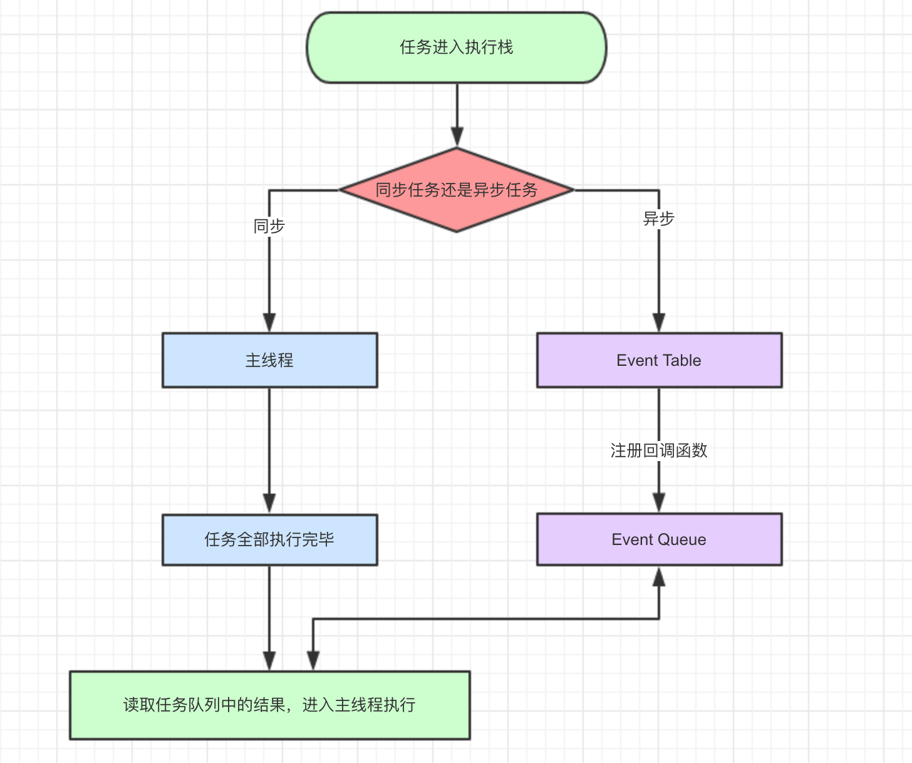

## JS 执行机制相关

> JS 是一门单线程的语言
> Event Loop (事件循环)是 JS 的执行机制

1. 输出内容

```js
async function async1() {
  console.log("async1 start");
  await async2();
  console.log("async1 end");
}
async function async2() {
  console.log("async2");
}
console.log("script start");
setTimeout(function () {
  console.log("setTimeout");
}, 0);
async1();
new Promise(function (resolve) {
  console.log("promise1");
  resolve();
}).then(function () {
  console.log("promise2");
});
console.log("script end");
```

结果:

```
script start
async1 start
async2
promise1
script end
async1 end
promise2
setTimeout
```

> 执行过程： 首先输出`script start`，`setTimeout`分发到宏任务队列等待执行，调用 async1 函数，并且立即执行，输出`async1 start`，调用 async2 函数，立即执行，输出`async2`， async2 返回一个 Promise，放入微任务队列中等待，await 会让出线程。执行 new Promise，输出`promise1`，resolve 放入微任务队列，输出`script end`。立即执行的代码都已执行完。

> 然后执行微任务队列，第一个就是前面 async1 中放进去的 Promise，输出`async1 end`。

> 接下来就是 new Promise 中放进去的 resolve 回调，输出`promise2`。

> 最后轮询执行宏任务 setTimeout，输出`setTimeout`。

**知识点：**

- **async：**

  - async 表达式定义的函数是立即执行的。async 函数返回一个 Promise 对象，当函数执行的时候，一旦遇到 await 就会先返回，等到触发的异步操作完成，再接着执行函数体内后面的语句。 可以理解为，是让出了线程，跳出了 async 函数体.
  - async function 声明将定义一个返回 AsyncFunction 对象的异步函数。
    当调用一个 async 函数时，会返回一个 Promise 对象。
    当这个 async 函数返回一个值时，Promise 的 resolve 方法会负责传递这个值；
    当 async 函数抛出异常时，Promise 的 reject 方法也会传递这个异常值

- **await:**

  - await 命令后面是一个 Promise 对象，返回该对象的结果。如果不是 Promise 对象，就直接返回对应的值。

- **Promise:**

  - Promise 是一个立即执行函数，但是他的成功（或失败：reject）的回调函数 resolve 却是一个异步执行的回调。
    当执行到 resolve()时，这个任务会被放入到回调队列中，等待调用栈有空闲时事件循环再来取走它。

- **[JS 执行机制](https://juejin.im/post/6844903512845860872)**

  

* 同步和异步任务分别进入不同的执行"场所"，同步的进入主线程，异步的进入 Event Table 并注册函数。
* 当指定的事情完成时，Event Table 会将这个函数移入 Event Queue。
* 主线程内的任务执行完毕为空，会去 Event Queue 读取对应的函数，进入主线程执行。
* 上述过程会不断重复，也就是常说的 Event Loop(事件循环)。

**setTimeout**
setTimeout，是经过指定时间后，把要执行的任务加入到 Event Queue 中

**setInterval**
setInterval 会每隔指定的时间将注册的函数置入 Event Queue

**Promise 与 promise.nextTick(callback)**

除了广义的同步任务和异步任务，我们对任务有更精细的定义：

- macro-task(宏任务)：包括整体代码 script，setTimeout，setInterval
- micro-task(微任务)：Promise，process.nextTick

事件循环的顺序，决定 js 代码的执行顺序。进入整体代码(宏任务)后，开始第一次循环。接着执行所有的微任务。然后再次从宏任务开始，找到其中一个任务队列执行完毕，再执行所有的微任务。

2. 再来一题

```js
async function async1() {
  console.log("async1 start");
  await async2();
  console.log("async1 end");
}

async function async2() {
  console.log("async2");
}

async1();

new Promise((resolve) => {
  console.log(1);
  resolve();
})
  .then(() => {
    console.log(2);
  })
  .then(() => {
    console.log(3);
  })
  .then(() => {
    console.log(4);
  });
```
答案：
```
async1 start
async2
1
async1 end
2
3
4
```
