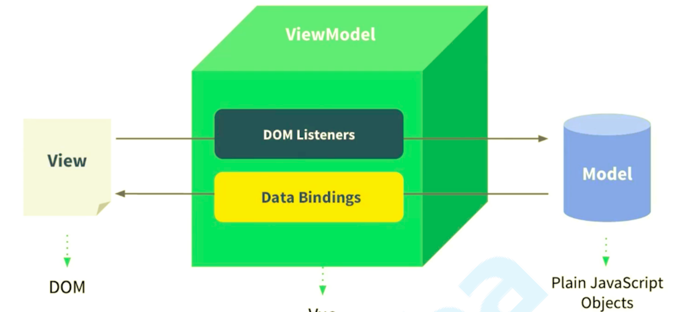

# 1.Vue 设计思想



**MVVM 框架的三要素：数据响应式、模板引擎及其渲染**

- 数据响应式：监听数据变化并在视图中更新
  - Object.defineProperty()
  - Proxy
- 模版引擎：提供描述视图的模版语法
  - 插值：{{}}
  - 指令：v-bind，v-on，v-model，v-for，v-if
- 渲染：如何将模板转换为 html
  - 模板 => vdom => dom

## 数据响应式原理

defineReactive 函数实现

1. defineProperty 对对象进行拦截处理，更新数据时更新视图
2. 嵌套对象响应式处理，需要递归遍历

```js
const obj = { foo: "foo", bar: "bar", baz: { a: 1 } };
```

3. 赋值为对象问题处理

```js
const obj = {};
obj.baz = { a: 1 };
obj.baz.a = 10; // no ok
```

4. 数组 - defineProperty() ⽆法感知数组的 push、pop、shift、unshift、splice、reverse、sort (7 个)⽅法对数组的修改，vue 采用将这些方法重写，

```js
// 1.定义响应式
function defineReactive(obj, key, val) {
  // 递归遍历
  observe(val);
  Object.defineProperty(obj, key, {
    get() {
      console.log("get", key);
      return val;
    },
    set(newVal) {
      if (newVal !== val) {
        console.log("get", key);
        val = newVal;
        update(); // 更新视图
      }
    },
  });
}

//  2. 处理第二个问题 递归遍历
function observe(obj) {
  if (obj === null || typeof obj !== "object") {
    return;
  }
  // 遍历对象中的所有属性，响应式处理
  Object.keys(obj).forEach((key) => {
    defineReactive(obj, key, val);
  });
}

// 3. 处理第三个问题
function set(obj, key, val) {
  defineReactive(obj, key, val);
}

// 更新视图函数
function update() {
  div.innerText = obj.foo;
}

const obj = {
  bar: {
    a: 1,
  },
};
defineReactive(obj, "foo", "foo");
obj.foo = new Date().toLocaleTimeString();

//  1.测试 对象响应式、视图更新
setInterval(() => {
  obj.foo = new Date().toLocaleTimeString();
}, 1000);

conso.log(obj.foo);

// 2. 测试 嵌套对象的响应式
obj.bar.a = "barrrrrrr";
console.log(obj.bar.a); // barrrrrrr

// 3. 测试
let obj2 = { a: 1 };
// obj2.baz = { b: 10 }; // 不能使用这种直接赋值方式
set(obj2, "baz", { b: 10 });
console.log(obj2.baz.b); //
```

## 依赖收集

详细代码见， `4-vue-code` 里面添加了详细的注解

# 2. vue 源码梳理

https://www.processon.com/view/link/5da6c108e4b002a6448895c3

## vue 初始化流程

测试代码 ./examples/test/01-init.html

### 环境配置

- 安装依赖 `npm i` 或 `yarn install`

- 在 package.json 文件 的 dev 脚本下， 开启 sourcemap ，`"dev": "rollup -w -c scripts/config.js --sourcemap --environment TARGET:web- full-dev"`

- 运行开发命令 `yarn dev`

### 入口

dev 脚本中 -c scripts/config.js 指明配置文件所在位置，参数 TARGET:web-full-dev 指明输出文件配置项

1. 入口 platforms/web/entry-runtime-with-compiler.js

   - 扩展默认$mount 方法：处理 template 或 el 选项, mount.call(this, el)

```
Function.call(thisobj, args...)

call()将指定的函数 function 作为对象 thisobj 的方法来调用，并传入参数列表中 thisobj 之后的参数。返回的是调用 function 的返回值。在函数体内，关键字 this 指代 thisobj 对象，如果 thisobj 位 null，则使用全局对象。
```

2. platforms/web/runtime/index.js

   - 安装 web 平台特有指令和组件
   - 定义**patch**：补丁函数，执行 patching 算法进行更新
   - 定义$mount：挂载 vue 实例到指定宿主元素（获得 dom 并替换宿主元素）

3. core/index.js

   - 初始化全局 API

   ```js
   Vue.set = set;
   Vue.delete = del;
   Vue.nextTick = nextTick;
   initUse(Vue); // 实现 Vue.use 函数
   initMixin(Vue); // 实现 Vue.mixin 函数
   initExtend(Vue); // 实现 Vue.extend 函数
   initAssetRegisters(Vue); // 注册实现 Vue.component/directive/filter
   ```

4. core/instance/index.js
   Vue 构造函数定义，定义 Vue 实例 API

   ```js
   function Vue(options) {
     // 构造函数仅执行了_init
     this._init(options);
   }
   initMixin(Vue); // 实现init函数
   stateMixin(Vue); // 状态相关api $data,$props,$set,$delete,$watch
   eventsMixin(Vue); // 事件相关api $on,$once,$off,$emit
   lifecycleMixin(Vue); // 生命周期api _update,$forceUpdate,$destroy
   renderMixin(Vue); // 渲染api _render,$nextTick
   ```

5. core/instance/init.js

创建组件实例，初始化其数据、属性、事件等

```js
vm._self = vm;
initLifecycle(vm); // $parent,$root,$children,$refs
initEvents(vm); // 处理父组件传递的事件和回调
initRender(vm); // $slots,$scopedSlots,_c,$createElement
callHook(vm, "beforeCreate");
initInjections(vm); // 获取注入数据
initState(vm); // 初始化props，methods，data，computed，watch
initProvide(vm); // 提供数据注入 callHook(vm, 'created')
```

- **$mount**

  - mountComponent 执行挂载，获取 vdom 并转换为 dom
  - new Watcher() 创建组件渲染 watcher， 一个组件一个 watcher
  - updateComponent() 执行初始化或更新
  - \_render() 渲染组件，获取 vdom
  - \_update() 初始化或更新，将传入 vdom 转换为 dom，初始化时执行的是 dom 创建操作

# 3. 异步更新

observe -> notify()(遍历关联的 watcher 的 update 方法) =>wather-> queueWatcher -> nextTick -> timerFunc -> flushCallbacks

- queueWatcher: 单个 watcher 只入队一次，nextTick 异步方式将 flushScherduler 放入队列

- nextTick:

- timerFunc: 异步执行 callback，Vue 在内部对异步队列尝试使用原生的 Promise.then 、 MutationObserver 或 setImmediate ，如果执行环境都不支持，则会采用 setTimeout 代替

- flushCallbacks 将 callBack 中函数全部回调一遍

- run watcher 真正执行更新的函数

**callback 和 flushSchedulerQueue 函数**

# 4. 虚拟 DOM

lifeCycle -> updateComponent -> \_update -> **patch** -> patchVnode -> updateChildren

- \_update 初始化和更新时传参不一样真实 dom / 虚拟 dom
- patchVnode 比较两个虚拟 vnode
- updateChildren 比较两组孩子节点

_面试题：_ Vue 中 key 的作用

```js
function sameVnode(a, b) {
  return (
    a.key === b.key && // key 没设置 undefined === undefined 永远为 true
    a.asyncFactory === b.asyncFactory &&
    ((a.tag === b.tag &&
      a.isComment === b.isComment &&
      isDef(a.data) === isDef(b.data) &&
      sameInputType(a, b)) ||
      (isTrue(a.isAsyncPlaceholder) && isUndef(b.asyncFactory.error)))
  );
}
```

key 的主要作用是为了高效的更新虚拟 DOM，其原理是 vue 在 patch 过程中通过 key 可以精准判断两个节点是否是同一个，从而避免频繁更新不同元素，使得整个 patch 过程更加高效，减少 DOM 操作量，提高性能。

## 其它

Object.defineProperty 循环依赖， 必须的在里面新添一个属性不然会造成循环引用

```js
const obj = {
  a: 1,
  b: 2,
};

let objCOPY = {};
Object.keys(obj).forEach((key) => {
  Object.defineProperty(objCOPY, key, {
    get() {
      console.log("get", key);
      return obj[key];
    },
  });
});
objCOPY.a;
```
