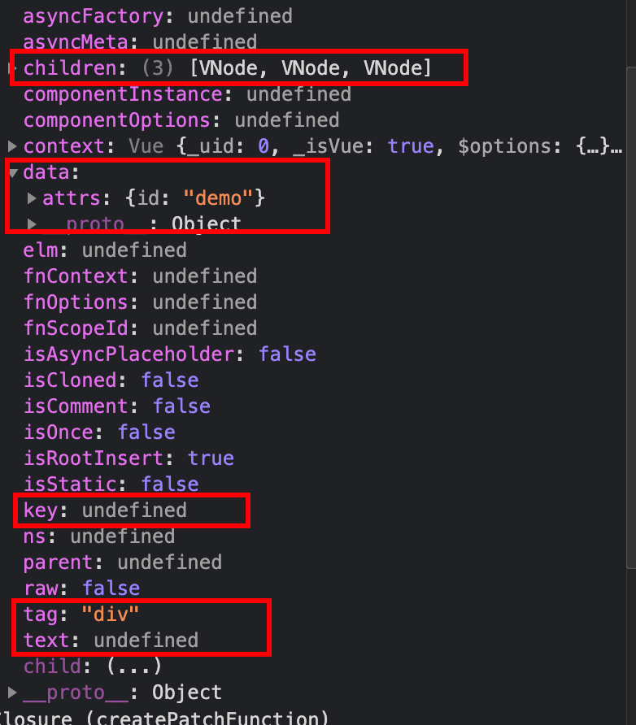
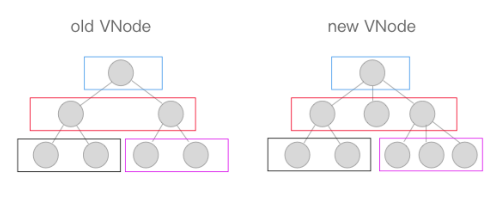

# Vue2 原理

结合源码阅读：https://github.com/dishui1238/vue-1

## vue2 初始化过程

范例： examples/test/01-init.html

1. new Vue 定义 Vue 构造函数 和 Vue 实例 API
   执行 \_init 函数
   initMixin(Vue) 实现 \_init 函数
   stateMixin(Vue) 实现 $data、$props、$set、$delete、$watch 状态相关 api
      eventsMixin(Vue) 实现 $on、$once、$off、$emit 事件相关 api
   lifecycleMixin(Vue) 实现 \_update、$forceUpdate、$destroy 声明周期相关 api
   renderMixin(Vue) 实现 $nextTick、\_render 渲染相关 api
2. \_init

   mergeOptions 合并选项, 添加了 direcives/filters/components

   initLifecycle(vm); // 挂载 $parent,$root,$children,$refs
   initEvents(vm); // 处理父组件传递的事件和回调
   initRender(vm); // $slots,$scopedSlots,\_c,$createElement
   callHook(vm, "beforeCreate");
   initInjections(vm); // resolve injections before data/props
   initState(vm); // 初始化 props、methods、data、computed、watch
   initProvide(vm); // resolve provide after data/props
   callHook(vm, "created");

3. $mount

   mountComponent 挂载组件，将 vnode 转化为 dom
   new Watcher() 创建组件渲染 watcher 监测组件 update，updateComponent 是组件的更新函数
   updateComponent 执行初始化或更新
   \_render() 渲染组件获取 vdom
   \_update() 将 vdom 转为 dom， 初始化(!prevVnode)执行 dom 创建操作

### 相关面试题思考

谈谈 vue 生命周期

- 概念：组件创建、更新和销毁过程
- 用途：生命周期钩子使我们可以在合适的时间做合适的事情
- 分类列举：
  - 初始化阶段：beforeCreate、created、beforeMount、mounted
  - 更新阶段：beforeUpdate、updated
  - 销毁阶段：beforeDestroy、destroyed
- 应用：
  - created 时，所有数据准备就绪，适合做数据获取、赋值等数据操作
  - mounted 时，$el 已生成，可以获取 dom；子组件也已挂载，可以访问它们
  - updated 时，数值变化已作用于 dom，可以获取 dom 最新状态
  - destroyed 时，组件实例已销毁，适合取消定时器等操作

## 数据响应式

范例： examples/test/02-reactive.html

上面说过，initState 函数中对 props、methods、data、computed、watch 进行了初始化，其中的 initData 是将 data 数据响应化处理，下面需要看一下 initData 具体做了些什么。

1. proxy(vm, `_data`, key)
   代理 data 数据 到 实例上，data 中的 key 不能与 methods、props 中的重复

2. observe(data, true /_ asRootData _/) 返回一个 ob 实例

   Observer 对象 根据传入数据类型是 数组/对象，分别做响应式处理 observeArray、walk， 其中主要调用了 defineReactive
   defineReactive 定义对象属性的 get/set，get 负责添加依赖，set 负责通知更新
   Dep 负责管理一组 Watcher，包括 watcher 实例的增删及通知更新

### 源码部分

源码部分做了简化，源码中要比这复杂得多。

源码部分较长，完整版在这里：https://github.com/dishui1238/Notes/blob/master/Vue/4-vue2-code/vue2.js

1. proxy 代理

```js
function proxy(vm, key) {
  // 将 data 对象遍历
  Object.keys(vm[key]).forEach((k) => {
    // 依次放到 this (vue 实例)上
    Object.defineProperty(vm, k, {
      get() {
        return vm[key][k];
      },
      set(val) {
        vm[key][k] = val;
      },
    });
  });
}
```

2. 数据响应式

Observer 对象： 数组响应式处理，对象响应式处理

```js
// 数组响应式，替换数组原型的 7 个方法
const originProto = Array.prototype;
const arrayProto = Object.create(originProto); // 复制数组原型

["push", "pop", "shift", "unshift", "splice", "reverse", "sort"].forEach(
  (method) => {
    const ob = this.__ob__;
    arrayProto[method] = function () {
      originProto[method].apply(this, arguments);
      // 通知更新
      ob.dep.notify();
    };
  }
);

class Observer {
  constructor(options) {
    this.options = options;

    Object.defineProperty(options, "__ob__", {
      value: this,
      enumerable: false,
      writable: true,
      configurable: true,
    });

    if (Array.isArray(options)) {
      // 数据处理，覆盖原型
      options.__proto__ = arrayProto;
      this.observeArray(options);
    } else {
      this.walk(options);
    }
  }

  // 遍历数据，定义响应式
  walk(obj) {
    Object.keys(obj).forEach((key) => {
      defineReactive(obj, key, obj[key]);
    });
  }

  // 数组响应式处理
  observeArray(items = []) {
    for (let i = 0, l = items.length; i < l; i++) {
      observe(items[i]);
    }
  }
}
```

defineReactive 函数

```js
// 定义响应式函数
function defineReactive(obj, key, val) {
  // 递归遍历
  observe(val);

  const dep = new Dep();
  Object.defineProperty(obj, key, {
    get() {
      // 收集依赖
      Dep.target && dep.addDep(Dep.target);
      return val;
    },
    set(newVal) {
      if (newVal !== val) {
        // 保证如果newVal是对象，再次做响应式处理
        observe(newVal);
        val = newVal;
        // 触发更新
        dep.notify();
      }
    },
  });
}
```

dep 对象

```js
class Dep {
  constructor() {
    this.deps = new Set(); // 不重复, 存放搜集到的 watcher 对象集合
  }
  addDep(dep) {
    this.deps.add(dep);
  }
  notify() {
    this.deps.forEach((dep) => dep.update());
  }
}
```

watcher 对象

```js
class Watcher {
  constructor(vm, expOrFn) {
    this.vm = vm;
    this.getter = expOrFn;

    // 依赖收集触发
    this.get();
  }

  get() {
    // 赋值为当前 Watcher 对象
    Dep.target = this;
    return this.getter.call(this.vm);
    // Dep.target = null;
  }

  update() {
    this.get();
  }
}
```

接下来还有一个问题，就是 watcher 从哪里创建的呢？

其实 new Vue 执行到最后，会调用 mount 方法，将 Vue 实例渲染成 dom 。

```js
class Vue {
  constructor(options) {
    this.$options = options;
    this.$data = options.data;

    // data 响应式处理
    observe(this.$data);

    // 代理，使data可以直接访问
    proxy(this, "$data");

    // new Compiler(options.el, this);

    if (options.el) {
      this.$mount(options.el);
    }
  }

  $mount(el) {
    this.$el = document.querySelector(el);
    const updateComponent = () => {
      const { render } = this.$options;
      const vnode = render.call(this, this.$createElement);
      this._update(vnode);
    };

    // 创建一个 watchwer 实例，一个组件一个 watcher
    new Watcher(this, updateComponent);
  }

  $createElement(tag, props, children) {
    return { tag, props, children };
  }

  // 将 虚拟 dom 变成真实 dom
  _update(vnode) {
    const prevVnode = this._vnode; // 老的 vnode
    if (!prevVnode) {
      // 初始化
      this.__patch__(this.$el, vnode); // 新增
    } else {
      this.__patch__(prevVnode, vnode);
    }
  }

  // 更新 dom 简化版
  __patch__(oldVnode, vnode) {
    // oldVnode 是 dom
    if (oldVnode.nodeType) {
      const parent = oldVnode.parentElement;
      const refEm = oldVnode.nextSibling;

      const el = this.createElm(vnode);
      parent.insertBefore(el, refEm);
      parent.removeChild(oldVnode);
    } else {
      const el = (vnode.el = oldVnode.el);
      // 简单判断，源码 sameVnode
      if (oldVnode.tag === vnode.tag) {
        // props 处理
        const oldProps = oldVnode.props || {};
        const newProps = vnode.props || {};
        for (const key in newProps) {
          const oldValue = oldProps[key];
          const newValue = newProps[key];

          // 属性更新
          if (oldValue !== newValue) {
            el.setAttribute(key, newValue);
          }
        }
        // 属性删除 - 老的里面有， 新的里面没有
        for (const key in oldProps) {
          if (!(key in newProps)) {
            el.removeAttribute(key);
          }
        }

        // children
        const oldChild = oldVnode.children;
        const newChild = vnode.children;
        if (typeof newChild === "string") {
          if (typeof oldChild === "string") {
            // 文本更新
            if (newChild !== oldChild) {
              el.textContent = newChild;
            }
          } else {
            el.textContent = newChild;
          }
        } else {
          // 老的是 文本, 新的是数组
          if (typeof oldChild === "string") {
            el.innerHTML = "";
            newChild.forEach((vnode) => this.createElm(vnode));
          } else {
            this.updateChildren(el, oldChild, newChild);
          }
        }
      }
    }
    this._vnode = vnode;
  }

  // 递归创建 dom 树
  createElm(vnode) {
    const el = document.createElement(vnode.tag);

    // props
    if (vnode.props) {
      for (const key in vnode.props) {
        el.setAttribute(key, vnode.props[key]);
      }
    }

    // children
    if (vnode.children) {
      if (typeof vnode.children === "string") {
        el.textContent = vnode.children;
      } else {
        vnode.children.forEach((vnode) => {
          const child = this.createElm(vnode);
          el.appendChild(child);
        });
      }
    }
    vnode.el = el;
    return el;
  }

  // 更新孩子节点
  updateChildren(parentEl, oldChild, newChild) {
    const len = Math.min(oldChild, newChild);
    // 遍历较短的数组
    for (let i = 0; i < len; i++) {
      this.__patch__(oldChild[i], newChild[i]);
    }

    // 新子节点更长，新增
    if (newChild.length > oldChild.length) {
      newChild.slice(len).forEach((child) => {
        const el = this.createElm(child);
        parentEl.appendChild(el);
      });
    } else if (newChild.length < oldChild.length) {
      oldChild.splice(len).forEach((child) => {
        parentEl.removeChild(child);
      });
    }

    // 旧的子节点更长， 删除
  }
}
```

## 异步更新

范例： examples/test/03-timerFunc.html

Vue 的异步更新策略是建立在 Event Loop 机制之上的，如果你不理解，可以点击[这里](https://jakearchibald.com/2015/tasks-microtasks-queues-and-schedules/?utm_source=html5weekly)

- 宏任务：**浏览器完成一个宏任务，会在下一个宏任务开始前渲染页面**。主要包括 script 代码、页面输入、网络时间、定时器等。
- 微任务：当前宏任务执行完之后会立即执行微任务，如果存在微任务，浏览器会在清空微任务之后再重新渲染。微任务主要由 Promise 的回调函数、dom 变化等

流程：observe -> notify()(遍历关联的 watcher 的 update 方法) =>wather-> queueWatcher -> nextTick -> timerFunc -> flushCallbacks

- queueWatcher: 单个 watcher 只入队一次

- nextTick: nextTick 异步方式将 flushScherduler 放入队列

- timerFunc: 异步执行 callback，Vue 在内部对异步队列尝试使用原生的 Promise.then 、 MutationObserver 或 setImmediate ，如果执行环境都不支持，则会采用 setTimeout 代替

- flushCallbacks 将 callBack 中函数全部回调一遍

- run watcher 真正执行更新的函数

**callback 和 flushSchedulerQueue 函数**

## 虚拟 dom

vue 中虚拟 dom 基于 snabbdom 实现，vdom 结构如下



### vdom 优点

1. 虚拟 DOM 轻量、快速：当它们发生变化时通过**新旧虚拟 DOM 对比**可以得到最小 DOM 操作量，配合异步更新策略减少刷新频率，从而提升性能
2. 跨平台：将虚拟 dom 更新转换为不同运行时特殊操作实现跨平台
3. 兼容性：还可以加入兼容性代码增强操作的兼容性

## diff

1. 首先进行树级别比较，可能有三种情况：增删改。

- new VNode 不存在就删；
- old VNode 不存在就增；
- 都存在就执行 diff 执行更新



2. 比较两个 VNode，包括三种类型操作：属性更新、文本更新、子节点更新
   具体规则如下：
   1. 新老节点均有 children 子节点，则对子节点进行 diff 操作，调用 updateChildren
   2. 如果新节点有子节点而老节点没有子节点，先清空老节点的文本内容，然后为其新增子节点。
   3. 当新节点没有子节点而老节点有子节点的时候，则移除该节点的所有子节点。
   4. 当新老节点都无子节点的时候，只是文本的替换。

## 组件化机制

Vue.component()

## 总结

Vue2.x 降低 watcher 粒度，引⼊ VNode 和 Patch 算法，⼤幅提升了 vue 在⼤规模应⽤中的适⽤性、扩平台
的能⼒和性能表现，是⼀个⾥程碑版本。但是同时也存在⼀定问题：

- 数据响应式实现在性能上存在⼀些问题，对象和数组处理上还不⼀致，还引⼊了额外的 API
- 没有充分利⽤预编译的优势，patch 过程还有不少优化空间
- 响应式模块、渲染器模块都内嵌在核⼼模块中，第三⽅库扩展不便
- 静态 API 设计给打包时的摇树优化造成困难
- 选项式的编程⽅式在业务复杂时不利于维护
- 混⼊的⽅式在逻辑复⽤⽅⾯存在命名冲突和来源不明等问题
