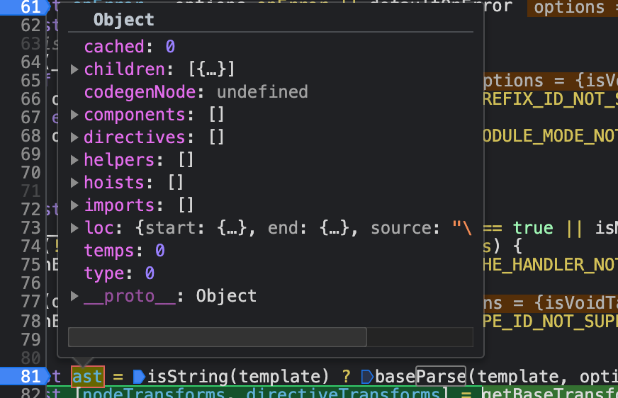
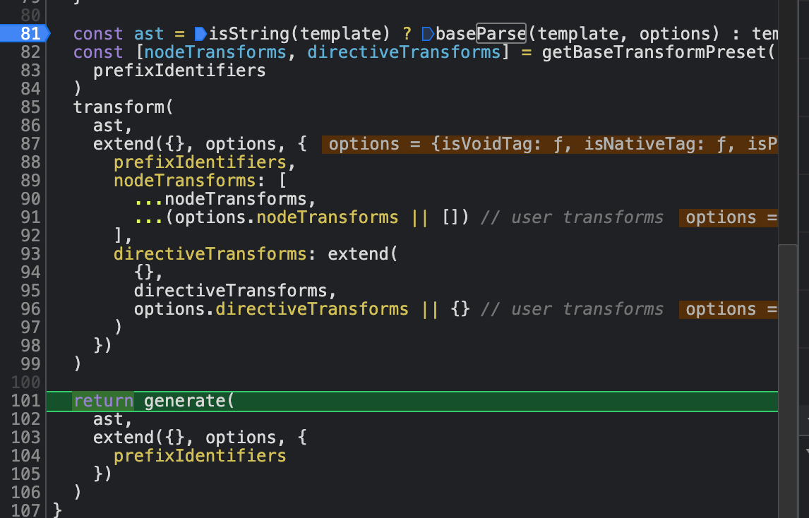
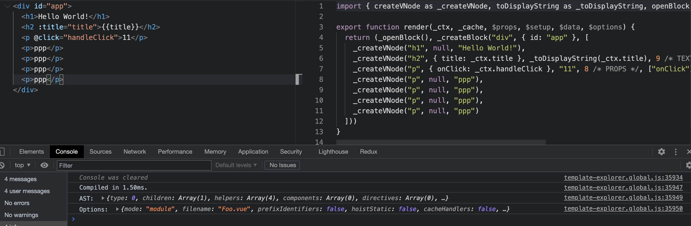
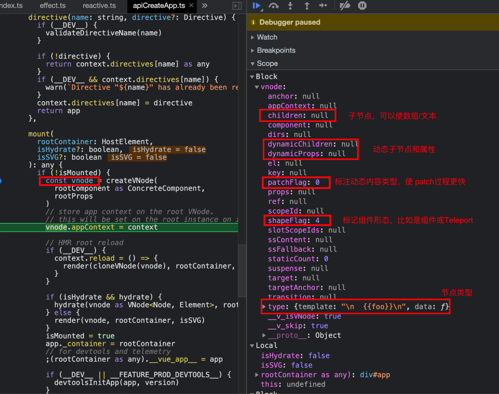

# Vue3 原理

## 初始化过程

ensureRenderer() => renderer => createApp()
createAppAPI() => createApp
app.mount() => render() => patch() => processComponent() => mountComponent()
=> setupComponent() => setupRenderEffect()

1.  createApp 创建 vue 实例、扩展 mount ⽅法

    ```js
    const app = ensureRenderer().createApp(...args);
    app.mount = () => {};
    ```

2.  ensureRenderer

    ```TS
    function ensureRenderer() {
      return (
        renderer ||
        (renderer = createRenderer <Node, Element> (rendererOptions))
      );
    }
    ```

3.  createRenderer() -> baseCreateRenderer

    ```js
    // baseCreateRenderer
    return {
      render,
      hydrate,
      createApp: createAppAPI(render, hydrate),
    };
    ```

    创建 renderer 对象，它对外暴露 3 个重要⽅法 render , hydrate , createApp ，其中 render ,和 hydrate 的实际使⽤者是 createApp()返回的 vue 实例对象

4.  createAppAPI

    ```js
    function createAppAPI(render, hydrate) {
      return function createApp() {
        const app = {
          use() {},
          mixin() {},
          component() {},
          directive() {},
          mount() {
            /**里面会调用 render 函数*/
          },
          unmount() {},
          provide() {},
        };
        return app;
      };
    }
    ```

    返回⽣产 vue 实例的 createApp 函数。component()/directive()/use()/mixin()这些⽅法都变成了实例⽅法，它们也会返回实例本身，链式调⽤成为可能。并且 filter 方法移除了。

    ```js
    createApp({})
      .component("comp", { template: "<div>this is comp</div>" })
      .directive("focus", {
        mounted(el) {
          el.focus();
        },
      })
      .mount("#app");
    ```

5.  mount

    ```js
    mount(rootContainer, isHydrate, isSVG){
      const vnode = createVNode(rootComponent,rootProps)
      render(vnode, rootContainer, isSVG)
    }
    ```

    将传入的 rootComponent 转化为 vnode，执行 render 函数。

6.  render
    ```js
    const render = (vnode, container, isSVG) => {
      if (vnode == null) {
        if (container._vnode) {
          unmount(container._vnode, null, null, true);
        }
      } else {
        patch(
          container._vnode || null,
          vnode,
          container,
          null,
          null,
          null,
          isSVG
        );
      }
      container._vnode = vnode;
    };
    ```
    将传⼊ vnode 渲染到容器 container 上
7.  patch(n1, n2, container)

    将传⼊的虚拟节点 n1 跟 n2 进⾏对⽐，并转换为 dom 操作。初始化时 n1 并不存在，因此操作将是⼀次 dom 创建。

8.  processComponent -> mountComponent

    执⾏组件挂载或更新，由于⾸次执⾏时 n1 为空，因此执⾏组件挂载逻辑 mountComponent().
    mountComponent 中 创建组件实例，执行 setupComponent 设置其数据状态， setupRenderEffect 建立渲染函数的副作用，收集依赖

    - setupComponent 函数中包含了 setup 选项的处理及 applyOptions 函数 对 vue2.x 选项的兼容处理
      vue2.x 的初始化顺序为：props、inject、methods、data、computed、watch

    - setupRenderEffect

## 数据响应式

applyOptions 中对 data 选项做响应式处理使⽤的是 reactive 函数

源码对应位置：packages/reactivity/src/effect.ts

```js
/**
 * 返回 proxy 对象
 * 如果目标对象是引用类型，需要递归处理；shallowReactive 不递归处理，只建立一层的响应式
 */
function reactive(obj){
  if(typeof obj !== 'object'){
    // 报错处理， reactive 接受对象
    return obj;
  }
  return new Proxy(obj){
    // 拦截取值操作
    get(target, key, receiver){
      console.log('get', key);
      // 触发依赖收集
      const res = Reflect.get(target, key, receiver)
      track(target, key)

      // 如果目标数据是对象，需要递归
      if(typeof obj === 'object'){
        return reactive(res)
      }

      return res
    },
    // 拦截赋值操作
    set(target, key, value, receiver){
      console.log('set', key)
      //  触发更新
      trigger(target, key)
      return Reflect.set(target, key, value,receiver)
    },

    // 拦截删除属性操作
    deleteProperty(target, key){
      console.log('deleteProperty', key)
      return Reflect.deleteProperty(target, key)
    }
  }
}
```

```js
/**
 * 收集依赖，建立 数据 -> 依赖[key -> effects] 的关系
 */
const targetMap = new WeakMap();
function track(target, key) {
  // 获取副作用(更新)函数
  const effect = effectStack[effectStack.length - 1];
  if (effect) {
    let depMap = targetMap.get(target);

    // 初始化时，depMap不存在
    if (!depMap) {
      depMap = new Map();
      targetMap.set(target, depMap);
    }

    // 从 depMap 中获取 effect 的集合
    let deps = depMap.get(key);

    // 初始化时 deps 不存在
    if (!deps) {
      deps = new Set(); // 去重, 保证 effect 函数只放进去一次
      depMap.set(key, deps);
    }
    // 放入新的副作用函数
    deps.add(effect);
  }
}
```

```js
/**
 * 触发副作用函数(更新)
 */

function trigger(target, key) {
  const depMap = targetMap.get(target);
  if (!depMap) return;
  const deps = depMap.get(key);

  // 循环执行内部所有 effect 函数
  if (deps) deps.forEach((dep) => dep());
}
```

```js
/**
 * 副作用函数
 */

// 存储副作用函数
const effectStack = [];
function effect(fn) {
  const e = createReactiveEffect(fn);
  // 立即执行
  e();
  return e;
}

function createReactiveEffect(fn) {
  const effect = function (...args) {
    try {
      effectStack.push(effect);
      return fn(...args);
    } finally {
      effectStack.pop();
    }
  };
  return effect;
}
```

测试代码：

```js
// 获取一个响应式对象
const state = reactive({ foo: "foo", bar: { n: 1 }, arr: [1, 2, 3] });

effect(() => {
  console.log("effect", state.foo);
});
effect(() => {
  console.log("effect2", state.foo, state.bar.n);
});
state.foo = "fooo~~~~~";
```

与 vue2.0 不同的是,即便是深度响应式我们也只能在获取上一级 get 之后才能触发下一级的深度响应式。 比如

```js
setup(){
 const state = reactive({ a:{ b:{} } })
 return {
     state
 }
}
```

在初始化的时候，只有 a 的一层级建立了响应式，b 并没有建立响应式，而当我们用 state.a 的时候，才会真正的将 b 也做响应式处理，也就是说我们访问了上一级属性后，下一代属性才会真正意义上建立响应式

### vue2 vs vue3

- vue2 中需要递归遍历对象所有 key，速度慢
- vue2 数组响应式需要额外实现
- vue2 新增或删除属性⽆法监听，需要使⽤特殊 api
- vue2 不⽀持 Map、Set、Class 等数据结构

## 编译器原理

packages/compiler-core/src/compile.ts

- 第⼀步解析-parse：解析字符串 template 为抽象语法树 ast
  
- 第⼆步转换-transform：解析属性、样式、指令等
- 第三步⽣成-generate：将 ast 转换为渲染函数
  

### 编译优化

可以在此网站上 `https://vue-next-template-explorer.netlify.com/ `查看不同的 dom 结构生成的渲染函数，并且可以在控制台查看生成时间和 AST 结构。



1. 静态节点提升
2. 补丁标记和动态属性记录
3. 缓存事件处理程序
4. 块 block

## 虚拟 dom 和 patch 算法

vue3 中的 vdom 结构



patch 部分 根据 vnode 的 type 执行不同的 patch 操作

```js
 const patch: PatchFn = (
    n1,
    n2,
    container,
  ) => {
    // ...

    const { type, ref, shapeFlag } = n2
    switch (type) {
      case Text:
        processText(n1, n2, container, anchor)
        break
      case Comment:
        processCommentNode(n1, n2, container, anchor)
        break
      case Static:
        if (n1 == null) {
          mountStaticNode(n2, container, anchor, isSVG)
        } else if (__DEV__) {
          patchStaticNode(n1, n2, container, isSVG)
        }
        break
      case Fragment:
        processFragment(
          n1,
          n2,
          container,
          anchor,
          parentComponent,
          parentSuspense,
          isSVG,
          slotScopeIds,
          optimized
        )
        break
      default:
        if (shapeFlag & ShapeFlags.ELEMENT) {
          processElement(
            n1,
            n2,
            container,
            anchor,
            parentComponent,
            parentSuspense,
            isSVG,
            slotScopeIds,
            optimized
          )
        } else if (shapeFlag & ShapeFlags.COMPONENT) {
          processComponent(
            n1,
            n2,
            container,
            anchor,
            parentComponent,
            parentSuspense,
            isSVG,
            slotScopeIds,
            optimized
          )
        } else if (shapeFlag & ShapeFlags.TELEPORT) {
          ;(type as typeof TeleportImpl).process(
            n1 as TeleportVNode,
            n2 as TeleportVNode,
            container,
            anchor,
            parentComponent,
            parentSuspense,
            isSVG,
            slotScopeIds,
            optimized,
            internals
          )
        } else if (__FEATURE_SUSPENSE__ && shapeFlag & ShapeFlags.SUSPENSE) {
          ;(type as typeof SuspenseImpl).process(
            n1,
            n2,
            container,
            anchor,
            parentComponent,
            parentSuspense,
            isSVG,
            slotScopeIds,
            optimized,
            internals
          )
        } else if (__DEV__) {
          warn('Invalid VNode type:', type, `(${typeof type})`)
        }
    }

    // set ref
    if (ref != null && parentComponent) {
      setRef(ref, n1 && n1.ref, parentSuspense, n2)
    }
  }
```

```js
function patchElement(n1, n2) {
  let { dynamicChildren } = n2
  // 一系列操作

  if (dynamicChildren) {
    patchBlockChildren (
      n1.dynamicChildren!,
      dynamicChildren,
      el,
      parentComponent,
      parentSuspense,
      areChildrenSVG
    )
  } else if (!optimized) {
    // full diff
    patchChildren(
      n1,
      n2,
      el,
      null,
      parentComponent,
      parentSuspense,
      areChildrenSVG
    )
  }
}
```

可以看见，如果有了 dynamicChildren 那么 vue2.x 版本中的 diff 操作就被替换成了 patchBlockChildren() 且参数只有 dynamicChildren，就是静态的不做 diff 操作了，而如果 vue-next 的 patch 中没有 dynamicChildren，则进行完整的 diff 操作，入注释写的 full diff 的后续代码。

patchChildren 中有这样一段代码

```js
if (patchFlag > 0) {
  if (patchFlag & PatchFlags.KEYED_FRAGMENT) {
      /* 对于存在key的情况用于diff算法 */
    patchKeyedChildren(
      c1 as VNode[],
      c2 as VNodeArrayChildren,
      container,
      anchor,
      parentComponent,
      parentSuspense,
      isSVG,
      optimized
    )
    return
  } else if (patchFlag & PatchFlags.UNKEYED_FRAGMENT) {
      /* 对于不存在key的情况,直接patch  */
    patchUnkeyedChildren(
      c1 as VNode[],
      c2 as VNodeArrayChildren,
      container,
      anchor,
      parentComponent,
      parentSuspense,
      isSVG,
      optimized
    )
    return
  }
    }
```

patchChildren根据是否存在key进行真正的diff或者直接patch
