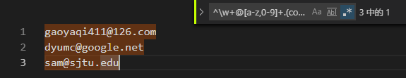

[TOC]

-------

# 十月份问题总结


## 第一周

### 1.input输入实时检测以及延时优化

```js
import { Bind, Debounce } from 'lodash-decorators';

@Bind()
@Debounce(500) // 防抖
handlePartySearch(value){
    const { dispatch } = this.props;
    dispatch({
        type: 'contractSearch/queryParty',
        payload: {
            partyName: value || '',
        },
    });
}
```

### 2. minio文件

### 3. FinalShell SSH工具

### 4. Date日期

+ #### 获取当前年月日

```react
const today = `${new Date().getFullYear()}-${new Date().getMonth()+1}-${new Date().getDate()}`; // 2019-10-11

import moment from 'moment';
console.log(moment().format('YYYY-MM-DD')); // 2019-10-11


<FormItem {...zhFormLayout.rightFormItemLayout} label="结算申请日期">
    {getFieldDecorator('requestDate', {
      initialValue: moment(), // 默认当前日期
    })(
        <DatePicker
        format={getDateFormat()}
    	disabled
    	style={{ width: '100%' }}
    />
)}
    </FormItem>
```

+ #### 对象格式

  antd日期选择框中的value

  

  ```js
  
  ```

+ #### 字符串格式

  `dateObject.toString()`        Thu Nov 07 2019 00:00:00 GMT+0800 // 对象格式转字符串格式

  `new Date()`       Fri Oct 11 2019 17:28:58 GMT+0800 (中国标准时间)

+ #### 计算两个日期之间相差的天数

  ```js
  const today = new Date(moment().format('YYYY-MM-DD'));
  const contractEndDay = new Date(moment(values.startDate[1]).format('YYYY-MM-DD'));
  // 字符串类型的日期相减
  const days = parseInt(contractEndDay-today, 10) / 1000 / 3600 / 24;// 有负值
  const days = Math.floor(contractEndDay-today) / 1000 / 3600 / 24;
  // 对象类型的日期相减
  values.startDate[1]-values.startDate[0]/ 1000 / 3600 / 24;
  ```

+ #### Date用法总结


## 第二周

### 1. 正则表达式

#### 1. 基本语法

| single char                               | quantifiers(数量)              | position(位置)             |
| ----------------------------------------- | ------------------------------ | -------------------------- |
| \d 匹配数字                               | *     0个或者更多              | ^一行的开头                |
| \w  匹配word(数字、字母)                  | +      1个或更多，至少1个      | $一行的结尾                |
| \W 匹配**非**word(数字、字母)             | ?       0个或1个,一个Optional  | \b 单词"结界"(word bounds) |
| \s 匹配white space(包括空格、tab等)       | {min,max} 出现次数在一个范围内 |                            |
| \S 匹配**非**white space(包括空格、tab等) | {n}    匹配出现n次的           |                            |
| . 匹配任何，任何的字符                    |                                |                            |

找5个字母组成的单词  ` \b\w{5}\b `

#### 2. 字符分类

>  分类符`[]` ,用来表示逻辑关系**或**， **在[]中，特殊字符不需要转义，可以直接使用，比如`[.()]`,但是在外面，是需要转义的`\(` `\.`等** 

 `[abc]` 表示a或b或c 

 `[-.]  `   表示符号`-`或者`.`号(**注意这里，在`[]`中的`.`号代表的就是这个符号，但是如果在其外面，表示个匹配所有。 所以如果不在`[]`之中，想要匹配'.'，就要通过转意符号`\.`**) 

 `[^ab]`   **[]中的^** 表示非， 啥都行，只要不是a或b 

 `[a-z]`，这就表示是从字母a到字符z。 


```
// 匹配邮箱        ^\w+@[a-z,0-9]+.(com|net|edu)
gaoyaqi411@126.com  
dyumc@google.net 
sam@sjtu.edu
```



#### 4.  分组捕获

```js
const link1 = '[google](http://google.com)' 
const reg2 = /\[(.*?)\]\((http:.*)\)/
console.log(link1.replace(reg2,'$2')); //http://google.com
```

```js
const name1 = 'shiffina, Daniel'
const reg = /(\w+),\s(\w+)/
console.log(name1.replace(reg,'$2 $1')); //Daniel shiffina
```

#### 5. 使用

-  **RegExp** 构造函数创建了一个正则表达式对象，用于将文本与一个模式匹配。 

  `new RegExp(pattern [, flags])`

  | flag | 含义                   |
  | ---- | ---------------------- |
  | g    | 全部的，给我匹配全部的 |
  | i    | 忽略大小写             |
  | m    | 多行匹配               |

  ```js
  var regex1 = /\w+/;
  var regex2 = new RegExp('\\w+');
  
  console.log(regex1); // expected output: /\w+/
  
  console.log(regex2); // expected output: /\w+/
  
  console.log(regex1 === regex2); // expected output: false
  ```

  

- **reg.test()** 测试是否包含，返回一个bool变量。

  ```js
  // 测试 "hello" 是否包含在字符串的最开始
  let str = 'hello world!';
  let result = /^hello/.test(str);
  console.log(result);   // true
  
  / 前要用\转义
  /^\/hwfl\/workflow\/task\/detail\//.test(window.location.pathname)
  ```

- **reg.exec()** 每次调用，返回一个匹配的结果，匹配结果和分组以数组的形式返回，不断的调用即可返回下一个结果，直到返回null

-  **str.match()** 返回第一个可以匹配的序列 

- **str.split()**

- **str.replace(reg,replace|function)**


### 2.  学习体系

###  

### 3. JS数组总结


## 第三周

### 1. 自定义滚动条样式

>  `::-webkit-scrollbar` 仅仅在支持[WebKit](https://webkit.org/)的浏览器 (例如, 谷歌Chrome, 苹果Safari)可以使用. 

- `::-webkit-scrollbar` — 整个滚动条.
- `::-webkit-scrollbar-button` — 滚动条上的按钮 (上下箭头).
- `::-webkit-scrollbar-thumb` — 滚动条上的滚动滑块.
- `::-webkit-scrollbar-track` — 滚动条轨道.
- `::-webkit-scrollbar-track-piece` — 滚动条没有滑块的轨道部分.
- `::-webkit-scrollbar-corner` — 当同时有垂直滚动条和水平滚动条时交汇的部分.
- `::-webkit-resizer` — 某些元素的corner部分的部分样式(例:textarea的可拖动按钮).

```less
.img-flowChart::-webkit-scrollbar {
  /* 高宽分别对应横竖滚动条的尺寸 */
  width: 10;
  height: 10;
}

.img-flowChart::-webkit-scrollbar-thumb {
  /* 滚动条里面小方块 */
  border-radius: 10px;
  box-shadow: inset 0 0 5px rgba(0, 0, 0, 0.2);
  background: #535353;
}

.img-flowChart::-webkit-scrollbar-track {
  /* 滚动条里面轨道 */
  box-shadow: inset 0 0 5px rgba(0, 0, 0, 0.2);
  border-radius: 10px;
  background: #ededed;
}
```

```react
	<div
        id="processImg"
        ref={ref => {
          this.processImage = ref;
        }}
        style={{ height: 500, overflow: 'auto' }}
        className={classNames(styles['img-flowChart'])}
      >
        
        {this.getForecastData(forecastData)}
      </div>
```

### 2.  合成事件（SyntheticEvent）

 https://zh-hans.reactjs.org/docs/events.html 

>  `SyntheticEvent` 实例将被传递给你的事件处理函数，它是浏览器的原生事件的跨浏览器包装器  

+  兼容所有浏览器

+  当你需要使用浏览器的底层事件时，只需要使用 `nativeEvent` 属性来获取即可。每个 `SyntheticEvent` 对象都包含以下属性 

+  内部使用事件池的概念，管理合成事件的创建，回收及其复用，提升性能 

  

**事件池**

+ SyntheticEvent是被池化的，也就是说，SyntheticEvent对象是被复用的，在回调函数调用完成之后，所有的属性都会被取消，这主要是考虑到性能的原因。所以说，你在异步方法中，不能访问到事件对象。

  当然，如果的确需要的话，可以调用`event.persist()`，该方法将会把合成事件从池中取出，始终在内存中保留对他的引用。


### 3. form表单回车提交问题

>  一般搜索行为，希望输入完关键词之后直接按回车键立即提交表单，而有些复杂表单，可能要避免回车键误操作在未完成表单填写的时候就触发了表单提交。 

**总结：**

1.  如果表单里有一个type=”submit”的按钮，回车键生效。 

2.  如果表单里只有一个type=”text”的input，即单个文本框，不管按钮是什么type，回车键生效。 
3. 如果表单里有多个个type=”text”的input，即多个文本框，按钮type=“button”时，回车键不提交。

4. 如果按钮不是用input，而是用button，并且没有加type，IE下默认为type=button，FX默认为type=submit。 

5. 其他表单元素如textarea、select不影响，radio checkbox不影响触发规则，但本身在FX下会响应回车键，在IE下不响应。 

**解决方案：**

1.  解决单个输入框的回车即提交问题 

   + 可以增加一个隐藏的input="text" display='none'; 然后type类型为button 。
   + 在form表单或input中加入：οnkeydοwn="if(event.keyCode==13){return false;}" 

   
   
   
   
   

## 第四周

### 1.  菜单滚动定位问题 


**产生原因：**

 菜单渲染父节点。默认渲染到 body 上，如果你遇到菜单滚动定位问题，试试修改为滚动的区域，并相对其定位 

**解决办法 ：getPopupContainer **

 `getPopupContainer={triggerNode => triggerNode.parentElement} `

**实例：**

```react
<div className={wrapClassNames.join(' ')} style={{position: 'relative'}}>
        <span className={iconClassNames.join(' ')} />
        <Select
          showSearch
          size="small"
          placeholder={intl.get('hzero.common.basicLayout.menuSelect').d('菜单搜索')}
          value={value}
          showArrow={false}
          className={styles.input}
          filterOption={false}
          onBlur={this.handleBlur}
          onFocus={this.handleFocus}
          onSearch={this.handleSearch}
          onSelect={this.handleSelect}
          getPopupContainer={triggerNode => triggerNode.parentNode}
        >
          {options}
        </Select>
        {this.renderHistory()}
  </div>
```


