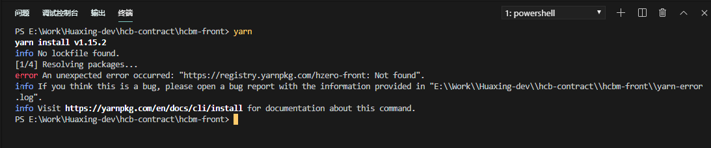

### 1. restProps

### 2.  `onChange`阶段表单值为什么还没有更新 

```react
  // 转换默认的 value 给控件
  normalize = (value, key, record) => {
    if (key === 'answerFlag' && value === 'Y') {
      if (JSON.stringify(this.getRecordForm) !== '{}') {
        this.getRecordForm.$form.setFieldsValue({ answerFlag: 'N' });
      }
      this.getRecordForm = record;
    }
    return value;
  };

  // 渲染Checkbox
  renderCheckbox = (key, record) => {
    const { getFieldDecorator } = record.$form;
    return (
      <React.Fragment>
        <Form.Item>
          {getFieldDecorator(key, {
            initialValue: record[key] === 'Y' ? 'Y' : 'N',
            normalize: value => this.normalize(value, key, record),
          })(<Checkbox checkedValue="Y" unCheckedValue="N" />)}
        </Form.Item>
      </React.Fragment>
    );
  };
```


### 3. 对象相关方法

+ Object.assign

  浅拷贝：如下**会改变res本身**

  

  ```react
  const setFieldsObj = Object.assign(res, {
     invoiceDate: res.invoiceDate ? moment(res.invoiceDate,'YYYY-MM-DD') : null,
  });
  
  // 正确使用
  const setFieldsObj = Object.assign({}, res, {
     invoiceDate: res.invoiceDate ? moment(res.invoiceDate,'YYYY-MM-DD') : null,
  });
  ```

+ Object.prototype.hasOwnProperty.call(record, 'key')

> `**hasOwnProperty()**` 方法会返回一个布尔值，指示对象自身属性中是否具有指定的属性（也就是，是否有指定的键）。
>
> 因为[javascript](http://lib.csdn.net/base/javascript)没有将hasOwnProperty作为一个敏感词，所以我们很有可能将对象的一个属性命名为hasOwnProperty，这样一来就无法再使用对象原型的 hasOwnProperty 方法来判断属性是否是来自原型链
>
> 怎么来解决这个问题呢？我们需要使用原型链上真正的 hasOwnProperty 方法

### 4. 常用正则

1. 千分符
2. 银行账号每四位加一个空格

```react
 disabledDate(current) {
    return current && current <moment().subtract(1, "days"); //当天之前的不可选，不包括当天
    //return current && current < moment().endOf(‘day’);当天之前的不可选，包括当天
 }

// 千分符
<InputNumber
    formatter={value => value && `${value}`.replace(/\B(?=(\d{3})+(?!\d))/g, ',')}
    precision={2}
    min={0}
    style={{ width: '100%' }}
/>)}

// 输入银行账号每四位加一个空格
<FormItem {...zhFormLayout.rightFormItemLayout} label="银行账号">
    {getFieldDecorator('bankAccountNumber', {
        rules: [
            {
                required: true,
                // pattern: new RegExp(/^[0-9]\d*$/, 'g'),
                message: '请输入正确的银行账号',
            },
        ],
    })(<InputNumber
           disabled={!isCanEdit}
           style={{ width: '100%' }}
           formatter={value => {
                if(/\d{5}/.test(value)){
                    return `${value}`.replace(/(\d{4})/g, "$1 ");
                }else{
                    return value;
                }
            }}
           />)}
</FormItem>
```

### 5.  localStorage, sessionStorage


**localStorage存对象**

```js
// 存
localStorage.setItem('partyInfo', JSON.stringify(partyInfo));
// 取
partyInfo: JSON.parse(localStorage.getItem('partyInfo'));
```


两者的共同点：

1、存储大小均为5M左右
2、都有同源策略限制
3、仅在客户端中保存，不参与和服务器的通信


两者的不同点在于：

1、生命周期 —— *数据可以存储多少时间*

- localStorage: 存储的数据是永久性的，除非用户人为删除否则会一直存在。
- sessionStorage: 与存储数据的脚本所在的标签页的有效期是相同的。一旦窗口或者标签页被关闭，那么所有通过 sessionStorage 存储的数据也会被删除。

2、`作用域` —— *谁拥有数据的访问权*

- localStorage: 在同一个浏览器内，`同源文档`之间共享 localStorage 数据，可以互相读取、覆盖。
- sessionStorage: 与 localStorage 一样需要同一浏览器同源文档这一条件。不仅如此，sessionStorage 的作用域还被限定在了窗口中，也就是说，只有同一浏览器、同一窗口的同源文档才能共享数据。


**API**

```js
//sessionStorage用法相同
localStorage.setItem("name",1);   // 以"x"为名字存储一个数值
localStorage.getItem("name");     // 获取数值
localStorage.key(i);              // 获取第i对的名字
localStorage.removeItem("name");  // 获取该对的值
localStorage.clear();             // 全部删除
```

### 6. [文章] 这一次，彻底弄懂 JavaScript 执行机制

> https://juejin.im/post/59e85eebf265da430d571f89


### 7. HZERO项目安装依赖




`set PUPPETEER_SKIP_CHROMIUM_DOWNLOAD=1`

` yarn install --registry http://nexus.saas.hand-china.com/content/groups/hzero-npm-group`

