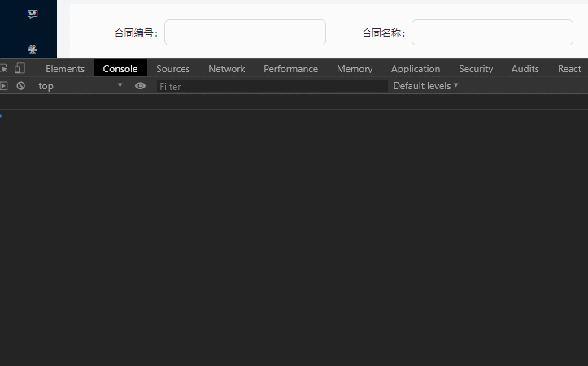
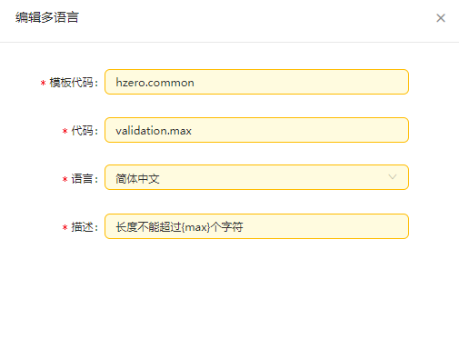

[TOC]


# 8月份问题总结


## 第一周问题

### 1. 防抖与节流

未防抖节流效果

```js
<Input onChange={()=> {
    console.log(e.target.value)
}} />
```




+ #### 函数防抖(debounce)

  > 在事件被触发n秒后再执行回调，如果在这n秒内又被触发，则重新计时。

  ```js
  let time2;
      document.getElementById('防抖').onclick =
      function () {
          clearTimeout(time2);
          time2=setTimeout(function () {
              //做一些快乐的事情
          },2000);
      };
  ```

  

+ #### 函数节流(throttle)

  

### 2. static getDerivedStateFromProps

> react v16.3 新增。每次接收新的props之后都会返回一个对象作为新的state，返回null则说明不需要更新state

### 3. antd 中 Form 组件向父组件传 value

### 4. window.location.search

### 5. 状态码

+ 200 - 请求成功，业务操作在返回值里判断 .then(res => console.log(res))，models中的 getResponse() 已经对错误进行了处理，所以 .then（res）中的 res 基本上认为是成功的返回值。

+ 204 - 无内容。服务器成功处理，但未返回内容。在该工程中通过 getResponse() 处理 response

  ```js
  if (response.status === 204) {
          return {};
   }
  ```

  返回{}，用 `if( JSON.stringfy(res) === '{}')`{ xxx }

+ 403 - 服务器理解请求客户端的请求，但是拒绝执行此请求。权限没配置。

+ 401 - 请求要求用户的身份认证。登录失效，刷新页面。

+ 500 - 服务器内部错误，无法完成请求。

  

### 6. 访问对象属性 . 操作和[]操作区别

+ 使用方括号语法时，应该把属性以字符串的形式放在方括号中

+ 方括号语法有一个**优点**：可以通过变量来访问属性

+ **还有**！如果属性名中包含会导致语法错误的字符，或者属性名是关键字或者保留字，也可以使用方括号表示法

+ []方括号访问的属性名时，可以在程序运行时创建和修改属性，点操作符就不行

  ***！！建议使用点表示法，除非必须使用变量来访问属性***

```js
    const nameTl = {};
    if (!err) {
        this.state.corpNameId.forEach(i => {
            nameTl[values[`language_${i}`].key] = values[`corpName_${i}`]
    })
    const params = {
        "nameTl": nameTl,
        "url": `${values.corpLogo}`,
        "master": values.setMainCorp,
    }
```


### 7. JS一元操作符

#### 1. delete

>  **delete 操作符**用于删除对象的某个属性；如果没有指向这个属性的引用，那它最终会被释放。
>
> **返回值：**对于所有情况都是`true`，除非属性是一个自己不可配置的属性，在这种情况下，非严格模式返回 `false`。

```js
var Employee = {
  firstname: "John",
  lastname: "Doe"
}
console.log(Employee.firstname);//  "John"

delete Employee.firstname;

console.log(Employee.firstname);// undefined
```

#### 2. `typeof`

`typeof(a)` 返回a的类型

#### 3. `void`

`void (expression)`   void运算符,表明一个运算没有返回值。expression是javaScript表达式,可执行

### 8. **encodeURI()** & encodeURIComponent()

> 函数通过将特定字符的每个实例替换转义序列来对统一资源标识符 (URI) 进行编码

+ `encodeURI` 不会替换以下字符：

  | 类型         | 包含                                          |
  | ------------ | --------------------------------------------- |
  | 保留字符     | `;` `,` `/` `?` `:` `@` `&` `=` `+` `$`       |
  | 非转义的字符 | 字母 数字 `-` `_` `.` `!` `~` `*` `'` `(` `)` |
  | 数字符号     | #                                             |

  *请注意，`encodeURI` 自身*无法*产生能适用于HTTP GET 或 POST 请求的 URI，例如对于 XMLHTTPRequests, 因为 "&", "+", 和 "=" 不会被编码，然而在 GET 和 POST 请求中它们是特殊字符。然而`encodeURIComponent`这个方法会对这些字符编码。*

+ `encodeURIComponent` 转义除了字母、数字、`(`、`)`、`.`、`!`、`~`、`*`、`'`、`-`和`_`之外的所有字符。

  *为了避免服务器收到不可预知的请求，对任何用户输入的作为URI部分的内容你都需要用encodeURIComponent进行转义。*

```js
encodeURI('+我') // "+%E6%88%91"
encodeURIComponent('+我') // "%2B%E6%88%91"
```


### 9. 跨域 option

浏览器将CORS请求分为两类：简单请求（simple request）和非简单请求（not-simple-request）,简单请求浏览器不会预检，而非简单请求会预检。出于安全考虑，并不是所有域名访问后端服务都可以。其实在正式跨域之前，浏览器会根据需要发起一次预检（也就是option请求），用来让服务端返回允许的方法（如get、post），被跨域访问的Origin（来源或者域），还有是否需要Credentials(认证信息)等。

+ ##### 简单请求

  对于简单请求，浏览器直接发出CORS请求。具体来说，就是在头信息之中，增加一个`Origin`字段，`Origin`字段用来说明，本次请求来自哪个源（协议 + 域名 + 端口）。服务器根据这个值，决定是否同意这次请求。

  如果`Origin`指定的源，不在许可范围内，服务器会返回一个正常的HTTP回应。浏览器发现，这个回应的头信息没有包含`Access-Control-Allow-Origin`字段（详见下文），就知道出错了，从而抛出一个错误

  

  如果`Origin`指定的域名在许可范围内，服务器返回的响应，会多出几个头信息字段

  

  **（1）Access-Control-Allow-Origin**

  ​	该字段是必须的。它的值要么是请求时`Origin`字段的值，要么是一个`*`，表示接受任意域名的请求。

  **（2）Access-Control-Allow-Credentials**

  ​	该字段可选。它的值是一个布尔值，表示是否允许发送Cookie。默认情况下，Cookie不包括在CORS请求之中。设为`true`，即表示服务器明确许可，Cookie可以包含在请求中，一起发给服务器。这个值也只能设为`true`，如果服务器不要浏览器发送Cookie，删除该字段即可。

  **（3）Access-Control-Expose-Headers**

  ​	该字段可选。CORS请求时，`XMLHttpRequest`对象的`getResponseHeader()`方法只能拿到6个基本字段：`Cache-Control`、`Content-Language`、`Content-Type`、`Expires`、`Last-Modified`、`Pragma`。如果想拿到其他字段，就必须在`Access-Control-Expose-Headers`里面指定。

+ ##### 非简单请求

  非简单请求是那种对服务器有特殊要求的请求，比如请求方法是`PUT`或`DELETE`，或者`Content-Type`字段的类型是`application/json`。

  

  "预检"请求用的请求方法是`OPTIONS`，表示这个请求是用来询问的。头信息里面，关键字段是`Origin`，表示请求来自哪个源

  **（1）Access-Control-Request-Method**

  ​	该字段是必须的，用来列出浏览器的CORS请求会用到哪些HTTP方法。

  **（2）Access-Control-Request-Headers**

  ​	该字段是一个逗号分隔的字符串，指定浏览器CORS请求会额外发送的头信息字段

  

  HTTP回应中，关键的是`Access-Control-Allow-Origin`字段，表示http://localhost:8000可以请求数据，该字段也可以设为星号，表示同意任意跨源请求。

  **（1）Access-Control-Allow-Methods**

    该字段必需，它的值是逗号分隔的一个字符串，表明服务器支持的所有跨域请求的方法。

  **（2）Access-Control-Allow-Headers**

  ​	如果浏览器请求包括`Access-Control-Request-Headers`字段，则`Access-Control-Allow-Headers`字段是必需的。它也是一个逗号分隔的字符串，表明服务器支持的所有头信息字段，不限于浏览器在"预检"中请求的字段。

  **（3）Access-Control-Allow-Credentials**

  ​		表示是否允许发送Cookie，同上

  **（4）Access-Control-Max-Age**

  ​	该字段可选，用来指定本次预检请求的有效期，单位为秒，即允许缓存该条回应18000秒，在此期间，不用发出另一条预检请求

### 10. initialValue

如果一开始initialValue没有值，然后通过接口调用拿到initialValue，把值写入，会出现的现象：form表单一开始是空的，并且可以编辑，然后u过了一会，突然form表单就被填值了。（突兀的现象）

1、进入编辑页面之前，先调取接口拿到数据（那么前置页面需要加loading），再进入表单页面，这时候表单页面立刻有值。当在编辑页面和编辑页面前置页是在同一个页面的时候，可以这样做。

2、编辑页面加loading，当拿到数据后，写入initialValue，再解开loading。当在编辑页面和编辑页面前置页是【不】在同一个页面的时候，只可以这样做，因为会出现刷新情况。

### 11. Form表单onValuesChange&getValueFromEvent

> Form.create(options)，onValuesChange 是options的一个配置项，任一表单域的值发生改变时的回调，
>
> 参数 (props, changedValues, allValues) 

// index.js 文件


// models


### 12.git 常用命令

+ 删除node_modules

  ```js
  $ npm install rimraf -g
  $ rimraf node_modules
  ```

+ 设置 git 签名

  ```js
  git config --list --local  // 查看本地使用的签名和邮箱 
  git config --list --global // 查看全局配置的签名和邮箱
  
  git config --global user.name "张青青"  // 设置本地（当前工程内）使用的签名
  git config --global user.email qingqing.zhang11@hand-china.com // 设置本地邮箱
  
  git config --local user.name "dishui1238" // 设置全局签名
  git config --local user.email 2358343663@qq.com
  ```

  

## 第二周问题

### 1. LVMH项目(基于HZero)

```js
LVMH测试账号
账号：22293
密码：hand12345678

线上地址：http://10.64.227.66:30001/
svn地址：svn://10.64.227.75/LVMH
svn用户名：名字全拼（如zhangyanghui），密码：123456

海马汇console平台
账号：qingqing.zhang11@hand-china.com
密码：handhand1234
```


#### 	1. 菜单配置

```js
1. 管理员账号进入 【菜单配置】
2. 【权限】
```


#### 	1. 获取 organizationId 方法

```js
organizationId: getUserOrganizationId(), // 当前用户organizationId
tenantId: getCurrentOrganizationId(), // 当前用户tenantId
    
initialValue: billingHeader.invoiceDate
                    ? moment(billingHeader.invoiceDate) // 只取年月日
                    : null,
```

#### 	2. 值集 & Lov  & 多语言

> 独立值集业务创建，Lov前端创建【值集定义，值集视图配置】




> 独立值集使用(一般用于selection)，公共的可用接口，一般在 `models` 中使用

```js
// common/codeconfig.js 首先进行配置值集编码

// 合同主数据
  counter: {
    counterType: 'CMDT.COUNTER_TYPE', // 柜台主数据类型
    customerType: 'CMDT.COUNTER_CUSTOMER_TYPE', // 客户类型
    brand: 'LVMH.COUNTER.BRAND', // 品牌
    counterCode: 'CMDT.COUNTER_CODE', // 柜台/商铺编码
  },
```


```js
// models 
import { getResponse } from 'utils/utils';
import { queryMapIdpValue } from '../../services/api';

// 类型值集
*loadTypeFastCode({ payload }, { call, put }) {
    const res = yield call(queryMapIdpValue, payload);
    if (getResponse(res)) {
        yield put({
            type: 'updateState',
            payload: {
                ...res,
            },
        });
    }
},


// routes
import codeConfig from 'common/codeConfig';
const { code } = codeConfig;

componentWillMount() {
    const { counterType, customerType } = code.counter; // 值集编码
    this.props.dispatch({
        type: 'counter/loadTypeFastCode',
        payload: {
            counterType,
            customerType,
        },
    });
    this.getMainDataList();
}
```

> Lov 使用

```html
import Lov from 'components/Lov';

<Form.Item
    {...formItemLayout}
    label={intl.get(`${intlCounter}.mainData.brand`).d('品牌')}
>
    {getFieldDecorator('brand')(
        <Lov
            code="CMDT.COUNTER_BRAND" // 值集编码 显示引用 不需要再codeconfig配置
            code={code.counter.brand} // 值集编码 需要引入和配置
            textField="brand"
            onChange={(text, record) => {
                if (record && record.unitName) {
                    this.props.form.setFieldsValue({
                        brand: record.unitName,
                    });
                }
            }}
        />
    )}
</Form.Item>
```

> 国际化、多语言使用

```react
import intl from 'utils/intl';
import formatterCollections from 'utils/intl/formatterCollections';

const commonPrompt = 'hzero.common'; // 多语言第一段编码
const intlCounter = 'lvmh.counter';

// 只要保证，你的组件在渲染时，已经有某个别的组件引入它，就可以了
// 进入被@formatterCollections({ code: [intlCounter, commonPrompt] })高阶过的react组件 	// 时，就会调接口，获取 code: [intlCounter, commonPrompt] 模板代码下的多语言数据。

@formatterCollections({ code: [intlCounter, commonPrompt] })

<Button type="normal" style={{ margin: '0 10px' }} onClick={this.handleReset}>
    {intl.get(`${commonPrompt}.button.reset`).d('重置')}
</Button>

```

*@formatterCollections 放在修饰器的最上方*

```js
@Form.create({ fieldNameProp: null }) // FIXME: 解决国际化第一次切换无效的问题
```


#### 3. 前端发布

```
ssh cmsapp_dev@10.64.227.66
// password Lvmh1234!
pwd 显示当前目录   ll 列出所有文件夹
cd hcbm/repo/hcbm-front
sh run.sh

// 解决冲突
git branch // 显示当前分支
git status
git checkout <files>
git pull
cat run.sh // 查看执行代码
```

执行之后：


#### 4. 导入和导出

> hzero导出组件: http://hzerodoc.saas.hand-china.com/zh/docs/development-specification/font-development-specification/component/export-component/
>
> hzero导入组件：http://hzero-ui.saas.hand-china.com/components/upload-cn/

```js
// 导出组件
import ExcelExport from '@/components/HCExcelExport';

<ExcelExport
   requestUrl={`${prefix}/${getCurrentOrganizationId()}/mdata/counters/export`}
/>
```

```js
// 导入组件
name	发到后台的文件参数名
accept	接受上传的文件类型
action	上传的地址
directory	支持上传文件夹（默认false）
beforeUpload 上传文件之前的钩子，参数为上传的文件，若返回 false 则停止上传，用于上传前的校验
headers	设置上传的请求头部
showUploadList	是否展示文件列表

  /**
   * 上传前的校验
   * @param {Object} file - 上传的文件
   */
  @Bind()
  beforeUpload(file) {
    const { fileSize = 50 * 1024 * 1024 } = this.props;
    if (file.size > fileSize) {
      file.status = 'error'; // eslint-disable-line
      const res = {
        message: intl
          .get(`hzero.common.upload.error.size`, {
            fileSize: fileSize / (1024 * 1024),
          })
          .d(`上传文件大小不能超过: ${fileSize / (1024 * 1024)}MB`),
      };
      file.response = res; // eslint-disable-line
      return false;
    }
    return true;
  }

@Bind()
  handleChange({ file }) {
    switch (file.status) {
      case 'error':
        this.setState({
          loadingImport: false,
        });
        notification.warning({
          message: intl.get(`${commonPrompt}.message.uploadError`).d('上传失败'),
        });
        break;
      case 'typeError':
        this.setState({
          loadingImport: false,
        });
        notification.warning({ message: file.response.message });
        break;
      case 'done':
        this.setState({
          loadingImport: false,
        });
        if (file.response && file.response.failed) {
          notification.error({
            message: intl
              .get(`${commonPrompt}.message.uploadError`)
              .d(`上传失败!${file.response.message}`),
          });
        } else {
          notification.success({
            message: intl.get(`${commonPrompt}.message.importSuccess`).d('导入成功'),
          });
          this.handleQuery();
        }
        break;
      default:
        break;
    }
  }

   const uploadProps = {
      name: 'excel',
      accept: '.xlxs, .xlsx',
      fileType: '.xlxs .xlsx',
      showUploadList: false,
      headers: { Authorization: `bearer ${getAccessToken()}` },
      action: `${API_HOST}${prefix}/${getCurrentOrganizationId()}/import/data/sync/auto-import?templateCode=CMDT.COUNTER_CREATE`,
      onChange: this.handleChange,
    };

// DOM
<Upload {...uploadProps}>
  	<Button type="normal" style={{ marginRight: '10px' }} onClick={this.handleUpload}>
      	<Icon type="upload" /> {intl.get('hzero.common.button.import').d('导入')}
	</Button>
</Upload>
```

#### 5. 时间取到日

```js
// 传递给接口
import { DEFAULT_DATE_FORMAT } from 'utils/constants';
import moment from 'moment';

 handleQuery({
      ...values,
      loadingImport: this.state.loadingImport,
      endDate: moment(values.endDate, DEFAULT_DATE_FORMAT),
  });

// 显示到 form 表单
initialValue: record && record.openDate ? moment(record.openDate) : undefined,      
```


## 第三周问题

### 1. 删除undefined的值

```js
 Object.keys(filterSearch).forEach(key => {
      if (filterSearch[key] === undefined) {
        delete filterSearch[key];
      }
    });
```


### 2. hzero校验(必输、必选、不为空)

```js
intl.get('hzero.common.validation.notNull', {})
intl.get('hzero.common.validation.requireInput', {})
intl.get('hzero.common.validation.requireSelect', {})
```

### 3.工作中出现的bug

```js
1. dispatch(...).then is not a function         
 解决办法：model层嵌套过深 namespace: 'basicInfo/partyInformation',改为一层结构

2. 
<Input></Input>标签内不能写东西

3. 
 date形式的数据，传入接口需要转化，在setFieldsValue({})，展示到<DatePicker>中也需要转换
4. 校验问题
 


```


## 第四周问题

### 1. Lov 的 value 与 显示值 的问题 

### 2. antd Table固定左/右侧列

```js

const column=[
    {
        title: intl.get(`${intlCounter}.mainData.counterAddress`).d('商铺/专柜地址'),
        dataIndex: 'counterAddress',
        textWrap: 'ellipsis',
        // 鼠标悬停展示
        render: (text) => (<Tooltip title={text}><div>{text}</div></Tooltip>),
      },
      {
        title: intl.get(`${intlCounter}.mainData.customerType`).d('柜台/商铺性质'),
        dataIndex: 'customerType',
        // width: '180px',
        render: text => // 值集翻译
          customerType.find(item => item.value === text)
            ? customerType.find(item => item.value === text).meaning
            : undefined,
      },
    {
        title: intl.get(`${commonPrompt}.button.action`).d('操作'),
        dataIndex: '',
        fixed: 'right',
        width: 100,
        render: (_, record) => (
          <a onClick={() => this.handleEdit(record)}>
            {intl.get(`${commonPrompt}.button.edit`).d('编辑')}
          </a>
        ),
      },
];

```

```js
// DOM
<Table
    bordered
    dataSource={mainDataList.content || []}
    columns={columns}
   	scroll={{ x: tableScrollWidth(columns) - 100 }} // 滚动条长度
    pagination={false}
    onChange={this.handlePaginationChange}
    loading={loadingGetMainDataList}
    rowKey="id"
/>

```


### 3. 文件批量上传

```js
// DOM
<Upload style={{marginLeft: '8px'}} {...bulkUploadProps}>
    <Button onClick={this.bulkUpload}>
        {intl.get(`${promptCode}.view.button.bulkUpload`).d('附件批量上传')}
	</Button>
</Upload>
```

```js
// 逻辑
const accessToken = getAccessToken();
const headers = {};
if (accessToken) {
    headers.Authorization = `bearer ${accessToken}`;
}

const bulkUploadProps = {
    name: 'file',
    multiple: true,
    accept: '.rar, .zip,.doc, .docx, .pdf, .jpeg, .png',
    showUploadList: false,
    data: this.uploadData,
    headers,// 将Token添加到请求头Header中
    action: `${HZERO_FILE}/v1/${getCurrentOrganizationId()}/files/secret-multipart`,
    beforeUpload: this.beforeUpload,
    onChange: this.onbulkUploadChange,
};

@Bind()
uploadData(file) {
    return {
        bucketName: 'hcbm-contract-attachments',
        fileName: file.name,
    };
}
```

```js
// this.beforeUpload
  /**
   * 上传前的校验
   * @param {Object} file - 上传的文件
   */
  @Bind()
  beforeUpload(file) {
    const { fileSize = 50 * 1024 * 1024 } = this.props;
    if (file.size > fileSize) {
      file.status = 'error'; // eslint-disable-line
      const res = {
        message: intl
          .get(`hzero.common.upload.error.size`, {
            fileSize: fileSize / (1024 * 1024),
          })
          .d(`上传文件大小不能超过: ${fileSize / (1024 * 1024)}MB`),
      };
      file.response = res; // eslint-disable-line
      return false;
    }
    return true;
  }
```

```js
/**
   * 上传change触发事件
   * @param {Object} info - 上传的文件
   */
  @Bind()
  onbulkUploadChange(info) {
    // console.log('info', info);
    // return;
    const { status, response, name } = info.file;
    const { dispatch, match } = this.props;
    const { id } = match.params;
    if (status === 'done') {
      // 校验上传的文件返回值
      notification.success({
        message: `${name} ${intl
          .get(`${promptCode}.view.message.uploadSuccess`)
          .d('文件上传成功！')}`,
      });
      dispatch({
        type: 'contractSearch/bulkUpload',
        payload: {
          contractId: id !== 'add' ? id : localStorage.getItem('currentBasicInfoId'),
          attachmentNumber: new Date().getTime(), // 自动生成
          fileId: 0,
          fileName: name,
          needArchive: false,
          needSignature: false,
          fileKey: response.fileKey,
          tenantId: getCurrentOrganizationId(),
        },
      });
    } else if (status === 'error') {
      notification.error(response);
    }
  }
```

+ 请求头


+ beforeUpload(file)上传文件之前的钩子，参数为上传的文件，若返回 `false` 则停止上传。 上传前的校验 file 参数（一般在此处限制上传文件的 大小、类型、名称）

  

+ 上传onChange(info)触发事件

  


