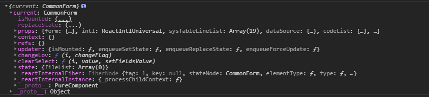
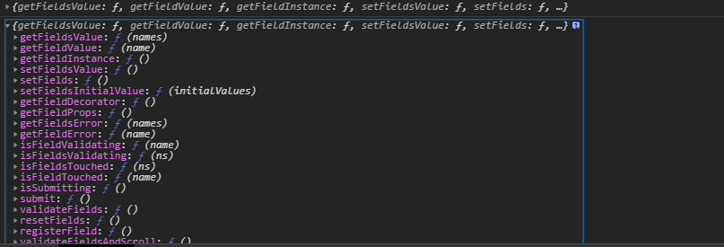
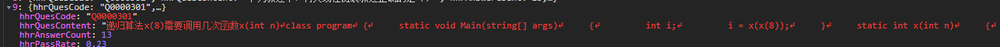
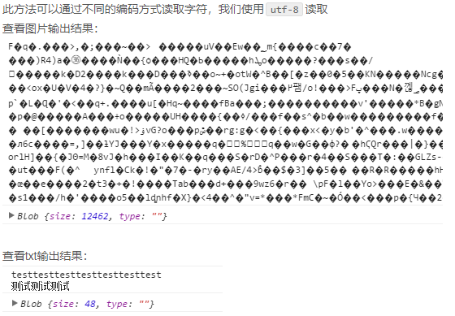
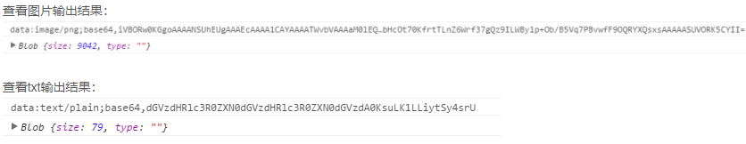
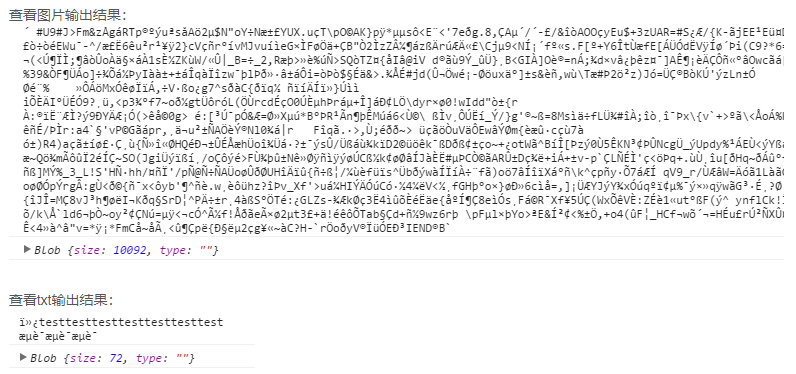
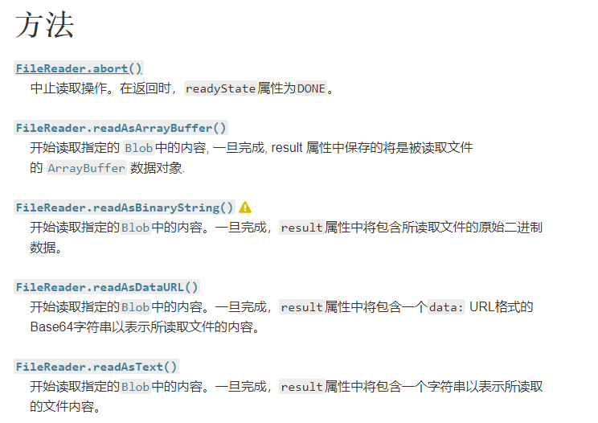

## 1.  *wrappedComponentRef*

使用antd form.create 后父组件获取ref时取到的是Form相关的属性和方法
在父组件中通过 wrappedComponentRef 代替 ref,才可以获取到自定义的属性和方法

#### 1. 使用

```react
// 子组件
@Form.create({ fieldNameProp: null })
export default class CommonForm extends React.PureComponent {
  constructor(props) {
    super(props);
    this.state = {
      fileList: [],
    };
  }
}

// 父组件
<CommonForm
    wrappedComponentRef={this.formRef}
 />

console.log(this.formRef)  // ---可以获取到自定义的属性和方法
```




#### 2. 实例

```react
// 子组件
@Form.create({ fieldNameProp: null })
export default class CommonForm extends React.PureComponent {
  constructor(props) {
    super(props);
    this.state = {
      fileList: [],
    };
  }
  componentDidMount() {
    this.props.onRef(this.props.form);
  }
}

// 父组件
export default class BasicInfo extends React.PureComponent {
  constructor(props) {
    super(props);
    this.state = {
      isFormItemChange: false,
    };
    this.formRef = React.createRef();
  }
  
  render(){
    console.log(this.formRef);  // -------取到的是Form相关的属性和方法
  	return (
  	<CommonForm      
       onRef={ref => {this.formRef = ref;}}
	/>
  	)
  }

```



## 2. model 中获取state的值

```react
*getCodes({ payload }, { select, call, put }) {
      const dynamicCodes = yield select(state => state.supplierManage.dynamicCodes); // 获取state值
      const res = getResponse(yield call(queryMapIdpValue, payload));
      if (res) {
        yield put({
          type: 'updateState',
          payload: {
            dynamicCodes: { ...dynamicCodes, res },
          },
        });
      }
    },
```

## 3. publicPath 

publicPath 总是以斜杠(/)开头和结尾,所以publicPath不能配置为./ 所以访问时会报错

https://www.cnblogs.com/ivan5277/articles/10829254.html

## 4. pre 保留原格式展示 



<div>
    <pre style={{ whiteSpace: 'pre-wrap' }}>
        {intl.get(`${formatCode}.hhr.field.question`).d('题目')}
        {index + 1 + (page - 1) * pageSize}：{hhrQuesContent}
     </pre>
</div>

## 5. toFixed() 四舍五入指定小数位数

## 6. 使用react-cropper实现图片裁剪上传

```js
import 'cropperjs/dist/cropper.css';
import Cropper from 'react-cropper'; 

uploadBefore = file => {
    // 1. 校验文件大小
    const fileSize = maxFileSize * 1024 * 1024;
    if (file.size > fileSize) {
        file.status = 'error'; // eslint-disable-line
        const res = {
            message: intl
            .get(`hzero.common.upload.error.size`, {
                fileSize: fileSize / (1024 * 1024),
            })
            .d(`上传文件大小不能超过: ${fileSize / (1024 * 1024)}MB`),
        };
        file.response = res; // eslint-disable-line
        return false;
    }
    // 1. FileReader
    // - FileReader 对象允许Web应用程序异步读取存储在用户计算机上的文件（或原始数据缓冲区）的内容，使用 File 或 Blob 对象指定要读取的文件或数据。
    // - 事件 FileReader.onload，在读取操作完成时触发
    // - 方法 
    const reader = new FileReader();
    // Image()函数将会创建一个新的HTMLImageElement实例, Image(width, height)
    // 它的功能等价于 document.createElement('img')
    const image = new Image(); 

    reader.readAsDataURL(file); //开始读取指定的Blob中的内容。一旦完成，result属性中将包含一个data: URL格式的Base64字符串以表示所读取文件的内容。
    // 1. img.onload
    // - img.onload 是回调函数，当img载入完成，就执行这个函数
    // - 当image的src发生改变，浏览器就会跑去加载这个src里的资源。这个操作是异步的，就是说，js不会傻傻地在原地等待图片的加载，而是继续读代码，直到图片加载完成，触发onload事件，js才会回来执行onload里面的内容。
    
    // 2. reader.onload
    // - 当 FileReader 读取文件的方式为  readAsArrayBuffer, readAsBinaryString, readAsDataURL 或者 readAsText 的时候，会触发一个 load 事件。从而可以使用  FileReader.onload 属性对该事件进行处理。
    
    reader.onload = e => { // onload 事件在图片加载完成后立即执行。
      image.src = reader.result;
      image.onload = () => {
        this.setState({
          srcCropper: e.target.result, // cropper的图片路径
          selectImgName: file.name, // 文件名称
          // selectImgSize: file.size / 1024 / 1024, // 文件大小
          // selectImgSuffix: file.type.split('/')[1], // 文件类型
          editImageModalVisible: true, // 打开控制裁剪弹窗的变量，为true即弹窗
        });
      };
    };
    return false; // 返回false,阻止文件上传
  };
}

  // 保存裁剪后的图片
  handleSaveImg = () => {
    const { dispatch } = this.props;
    const { selectImgName } = this.state;
    if (this.state.srcCropper) {
      this.setState({ saveImgLoading: true });
      // getCroppedCanvas方法可以将裁剪区域的数据转换成canvas数据
      // 然后调用浏览器原生的toBlob方法将canvas数据转换成blob数据
      this.cropper.getCroppedCanvas().toBlob(blob => {
        const formData = new FormData();
     // 第三个参数为文件名，可选填. formData.append(name, value, filename);vlaue只支持blob string File
        formData.append('file', blob, selectImgName);
        // 之后将blob数据发送至后端
        dispatch({
          type: 'manageMarquee/uploadImage',
          payload: formData,
        }).then(res => {
          if (res && !res.failed) {
            this.setState({
              saveImgLoading: false,
              editImageModalVisible: false,
              fileList: [
                {
                  uid: -1,
                  name: res.hhrFileName,
                  status: 'done',
                  url: res.hhrFileUrl,
                },
              ],
            });
            notification.success({
              message: intl.get('hitf.caManagement.view.message.upload.success').d('上传成功！'),
            });
          }
        });
      });
    }
  };

render(){
    const fileProps = {
      showDownloadIcon: true,
      fileListMaxLength: 1,
      accept: ['image/jpeg', 'image/jpg', 'image/png'],
      headers: {
        Authorization: `Bearer ${cookieToken}`,
      },
      onRemove: () => {
        this.setState({
          fileList: [],
        });
      },
    };
    return (
     <>
        <Upload
            action={`${API_HOST}${BOOGOO_TRAINING}/v1/${organizationId}/trn-course-period-marquees/upload`}
            headers={{ Authorization: `Bearer ${cookieToken}` }}
            listType="picture-card"
            // onPreview={this.handlePreview}
            beforeUpload={this.uploadBefore}
            fileList={fileList}
            showUploadList={{
                removePopConfirmTitle: intl.get(`${formatCode}.hhr.msg.ifDelete`).d('是否删除'),
            }}
            {...fileProps}
            showPreviewIcon
            >
            {fileList.length >= 1 ? null : (
                <div>
                    <Icon type="plus" />
                    <div className="ant-upload-text">Upload</div>
                </div>
            )}
        </Upload>
        <Modal
          className="upload_copper_modal"
          visible={this.state.editImageModalVisible}
          width={820}
          onCancel={() => this.setState({ editImageModalVisible: false })}
          title={intl.get(`${commonCode}.hhr.title.selectClippingArea`).d('选择剪裁区域')}
          footer={[
            <Button type="primary" loading={saveImgLoading} onClick={this.handleSaveImg}>
              {intl.get(`${commonCode}.hhr.btn.determine`).d('确定')}
            </Button>,
            <Button onClick={() => this.setState({ editImageModalVisible: false })}>
              {intl.get(`${commonCode}.hhr.btn.cancel`).d('取消')}
            </Button>,
          ]}
        >
          <Cropper
            src={this.state.srcCropper || ''} // 图片路径，即是base64的值，在Upload上传的时候获取到的
            ref={cropper => {
              this.cropper = cropper;
            }}
            preview=".uploadCrop"
            viewMode={1} // 定义cropper的视图模式
            zoomable={false} // 是否允许放大图像
            // movable
            guides={false} // 显示在裁剪框上方的虚线
            background={false} // 是否显示背景的马赛克
            rotatable={false} // 是否旋转
            autoCropArea={1} // 默认值0.8（图片的80%）。--0-1之间的数值，定义自动剪裁区域的大小
            style={{ width: '100%', height: '400px' }}
            aspectRatio={1152 / 382} // 固定为1:1  可以自己设置比例, 默认情况为自由比例
            // cropBoxResizable={false} // 默认true ,是否允许拖动 改变裁剪框大小
            // cropBoxMovable  // 是否可以拖拽裁剪框 默认true
            dragMode="move" // 拖动模式, 默认crop当鼠标 点击一处时根据这个点重新生成一个 裁剪框，move可以拖动图片，none:图片不能拖动
            center
          />
        </Modal>
   </>
);


```

### 1. FileReader 方法  

 参考文章 https://www.cnblogs.com/dongxixi/p/11005607.html

+ readAsText 读取文件的单位是字符，故对于文本文件，只要按规定的编码方式读取即可；
  而对于媒体文件（图片、音频、视频），其内部组成并不是按字符排列，故采用readAsText读取，会产生乱码，同时也不是最理想的读取文件的方式

  

+ readAsDataURL会将文件内容进行base64编码后输出

  

+ ### readAsBinaryString

  与readAsText不同的是，readAsBinaryString函数会按字节读取文件内容。
  然而诸如0101的二进制数据只能被机器识别，若想对外可见，还是需要进行一次编码，而readAsBinaryString的结果就是读取二进制并编码后的内容。
  尽管readAsBinaryString方法可以按字节读取文件，但由于读取后的内容被编码为字符，大小会受到影响，故不适合直接传输，也不推荐使用。
  如：测试的图片文件原大小为6764 字节，而通过readAsBinaryString读取后，内容被扩充到10092个字节

  

+ ### readAsArrayBuffer

  与readAsBinaryString类似，readAsArrayBuffer方法会按字节读取文件内容，并转换为ArrayBuffer对象。
  我们可以关注下文件读取后大小，与原文件大小一致。
  这也就是readAsArrayBuffer与readAsBinaryString方法的区别，readAsArrayBuffer读取文件后，会在内存中创建一个ArrayBuffer对象（二进制缓冲区），将二进制数据存放在其中。通过此方式，我们可以直接在网络中传输二进制内容。



### 2. FileReader 应用

我们知道，img的src属性或background的url属性，可以通过被赋值为图片网络地址或base64的方式显示图片。
在文件上传中，我们一般会先将本地文件上传到服务器，上传成功后，由后台返回图片的网络地址再在前端显示。
通过FileReader的readAsDataURL方法，我们可以不经过后台，直接将本地图片显示在页面上。这样做可以减少前后端频繁的交互过程，减少服务器端无用的图片资源

对于图片上传，我们也可以先将图片转换为base64进行传输，此时由于传输的图片内容就是一段字符串，故上传接口可以当做普通post接口处理，当图片传输到后台后，可以在转换为文件实体存储。
当然，考虑到base64转换效率及其本身的大小，本方法还是适合于上传内容简单或所占内存较小的文件。

### 3. 使用FormData对象上传文件

使用append()方法时，可以通过第三个可选参数设置发送请求的头 `Content-Disposition `指定文件名。如果不指定文件名（或者不支持该参数时），将使用名字“blob”

### 4. toDataURL 与 toBlob