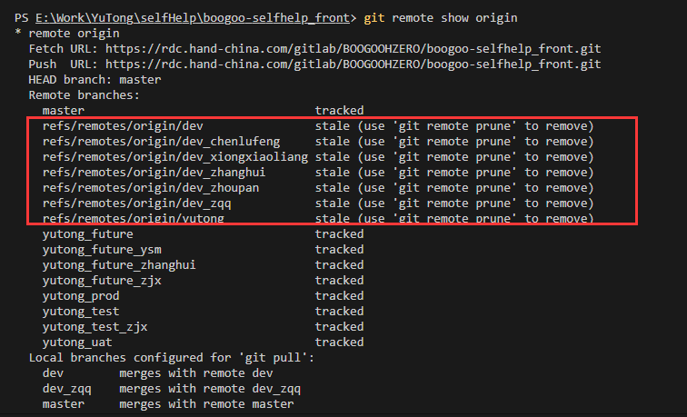

## 1. JSON字符串

+ 字符串最后不能有逗号

## 2. git同步远程已删除的分支和删除本地多余的分支

### 1.  同步本地的远程分支

+ `git branch -a`  查看本地分支和远程分支情
+ `git remote show origin` 查看本地分支和追踪情况(可以发现红框中的分支是远程分支已被删除的分支，根据提示可以使用 git remote prune 来同步删除这些分支。)

+ `git remote prune origin` 移除远程已删除的分支

### 2. 删除本地多余分支

+ `git branch -D branchName` 删除本地多余分支

### 3. 创建本地分支并推送到远程

+ `git branch 分支名` 创建本地分支
+ `git push origin <local_branch_name>:<remote_branch_name>` 一般当前如果不在该分支时，使用这种方式提交。如果当前在 local_branch_name 分支下，也可以直接提交`git push origin <local_branch_name>`

