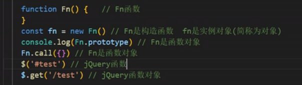
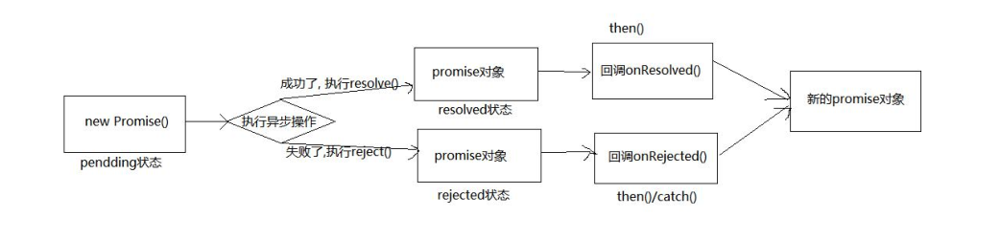

## 一. 基础

### 1.1 函数对象 与 实例对象

1. 实例对象: new 函数产生的对象, 称为实例对象, 简称为对象

2. 函数对象: 将函数作为对象使用时, 简称为函数对象

   


### 1.2 两种类型的回调函数

####  1.2.1 同步回调

1. 理解: 立即执行, 完全执行完了才结束, 不会放入回调队列中

2. 例子: 数组遍历相关的回调函数 / Promise 的 excutor 函数

####  1.2.3 异步回调

	1. 理解: 不会立即执行, 会放入回调队列中将来执行
 	2. 例子: 定时器回调 / ajax 回调 / Promise 的成功|失败的回调


### 1.3 JS 的 error 处理


#### 1.3.1 错误的类型

1. Error: 所有错误的父类型

2. ReferenceError: 引用的变量不存在
3. TypeError: 数据类型不正确的错误
4. RangeError: 数据值不在其所允许的范围内 （死循环）
5. SyntaxError: 语法错误

#### 1.3.2 错误处理

 1. 捕获错误 try .... catch

    ```js
    try {
      let d;
      console.log(d.xxx);
    } catch (error) { // error 是一个对象
      console.log(error.message);
      console.log(error.stack);
    }
    ```

 2. 抛出错误 

    ```js
    throw error
    ```

    

## 二、Promise 的理解和使用

### 2.1 Promise 是什么

#### 2.1.1 promise 基本流程



#### 2.1.2 Promise 的状态改变

```js
 // 1. 创建一个新的promise对象
    const p = new Promise((resolve, reject) => {// 执行器函数  同步回调
      console.log('执行 excutor')
      // 2. 执行异步操作任务
      setTimeout(() => {
        const time = Date.now() // 如果当前时间是偶数就代表成功, 否则代表失败
        // 3.1. 如果成功了, 调用resolve(value)
        if (time %2 == 0) {
          resolve('成功的数据, time=' + time)
        } else {
        // 3.2. 如果失败了, 调用reject(reason)
          reject('失败的数据, time=' + time)
        }
      }, 1000);
      
    })
    console.log('new Promise()之后')

    // setTimeout(() => {
      p.then(
      value => { // 接收得到成功的value数据    onResolved
        console.log('成功的回调', value)  
      },
      reason => {// 接收得到失败的reason数据  onRejected
        console.log('失败的回调', reason)
      }
    // )
    // }, 2000);
```
