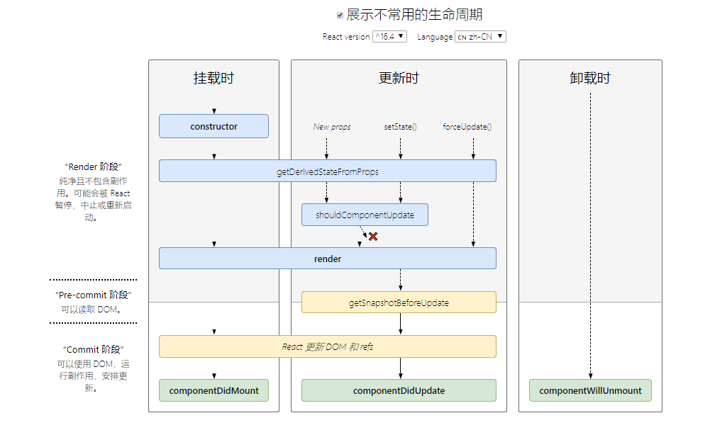

# 一、 react

## 1. 类组件状态管理 setState

> `setState(nextState, callback)` UI 更新最常用的方法, 默认调用 setState 都会重新渲染视图

> nextState 也可以是一个 function，称为状态计算函数，结构为`function(state, props) => newState`。该函数接受两个参数: 更新前的 state 与当前的属性(props)，函数返回一个对象用于更新 state。这个函数会将每次更新加入队列中，执行时通过当前的 state 和 props 来获取新的 state。

### 1. class 中同步实现

```js
this.state = { counter: 0 };
// 1. 函数方式
onClick = () => {
  this.setState((nextState) => {
    //第一次执行 nextState = 0
    return { counter: nextState.counter + 1 };
  });

  this.setState((nextState) => {
    // 第一次执行 nextState = 1
    return { counter: nextState.counter + 2 };
  });
};
// 一次后 counter = 3， 每一次 counter 增加 3

// 2. setTimeout
setTimeout(() => {
  // setTimeout中调用
  this.setState({ count: this.state.count + 1 });
  console.log("setTimeout: " + this.state.count); // 可以立马获取到最新的state
}, 0);

// 3. 原生事件
```

每次更新时都会提取出当前的 state，进行运算得到新的 state，就保证了数据的同步更新。

总结：

1. `setState` 只在合成事件和钩子函数中是“异步”的，在原生事件(addEventListener 直接添加的事件处理函数)和 `setTimeout`和`setInterval` 中都是同步的 (react 为了解决跨平台，兼容性问题，自己封装了一套事件机制，代理了原生的事件，像在 jsx 中常见的 onClick、onChange 这些都是合成事件)。

2. `setState` 的批量更新优化也是建立在“异步”（合成事件、钩子函数）之上的，在原生事件和`setTimeout` 中不会批量更新，在“异步”中如果对同一个值进行多次 `setState` ， `setState` 的批量更新策略会对其进行覆盖，取最后一次的执行，如果是同时 `setState` 多个不同的值，在更新时会对其进行合并批量更新。

## 2. Hooks

> function 组件里。Hook 是 React 16.8 的新增特性。它可以让你在不编写 class 的情况下使用 state 以及其他的 React 特性。

## 3. 生命周期函数



1. **componentDidUpdate(prevProps, prevState, snapshot)**

   > 在更新后会被立即调用。首次渲染不会执行此方法。

2. **static getDerivedStateFromProps(props, state)**

   > getDerivedStateFromProps 会在调用 render 方法之前调用，并且在初始挂载及后续更新时都会被调用。它应返回一个对象来更新 state，如果返回 null 则不更新任何内容。

3. **getSnapshotBeforeUpdate(prevProps, prevState)**

   > getSnapshotBeforeUpdate() 在最近一次渲染输出（提交到 DOM 节点）之前调用。它使得组件能在发生更改之前从 DOM 中捕获一些信息（例如，滚动位置）。此生命周期的任何返回值将作为参数传递给 componentDidUpdate()。

## 4. 组件的跨层级通信 context

### 4.1 `React.createContext`

> 创建一个 Context 对象。当 React 渲染一个订阅了这个 Context 对象的组件，这个组件会从组件树中离自身最近的那个匹配的 `Provider` 中读取到当前的 context 值

### 4.2 `Context.Provider`

> 当 Provider 的 `value` 值发生变化时，它内部的所有消费组件都会重新渲染。Provider 及其内部 consumer 组件都不受制于 `shouldComponentUpdate` 函数，因此当 consumer 组件在其祖先组件退出更新的情况下也能更新。

> 因为 context 会使用参考标识（reference identity）来决定何时进行渲染，这里可能会有一些陷阱，当 provider 的父组件进行重渲染时，可能会在 consumers 组件中触发意外的渲染。举个例子，当每一次 Provider 重渲染时，以下的代码会重渲染所有下面的 consumers 组件，因为 value 属性总是被赋值为新的对象 `<MyContext.Provider value={{something: 'something'}}>`

### 4.3 `Context.Consumer`

```js
<MyContext.Consumer>
  {value => /* 基于 context 值进行渲染*/}
</MyContext.Consumer>
```

一个 React 组件可以订阅 context 的变更，这让你在函数式组件中可以订阅 context。需要一个函数作为子元素。

**例子：**

```js
// 父组件
export const Context = React.createContext();

const store = {
  home: {},
  user: {
    name: "zqq",
  },
};

class App extends React.Component {
  render() {
    return (
      <div className="App">
        <Context.Provider value={store}>
          <Context.Consumer>
            {(val) => <Home {...val} />} // val传递的即为Provider中的value
          </Context.Consumer>
        </Context.Provider>
      </div>
    );
  }
}
```

```js
// 子组件
export default class Home extends Component {
  render() {
    console.log(this.props);
    return <div>Home</div>;
  }
}
```

## 5.组件复合（Composition）

## 6. 高阶组件 HOC

> 高阶组件是一个工厂函数，它接收一个组件并返回另一个组件

例子：实现 antd 中的 Form.create()

```jsx
import React, { Component } from "react";

function FormCreate(Cmp) {
  return class extends Component {
    constructor(props) {
      super(props);
      this.options = {};
      this.state = {};
    }

    handleChange = (e) => {
      const { name, value } = e.target;
      this.setState({ [name]: value });
    };

    getFieldDecorator = (field, options) => {
      if (options && options.rules && options.rules.required) {
        this.options[field] = options;
      }
      return (InputCmp) => (
        <div>
          {React.cloneElement(InputCmp, {
            name: field,
            value: this.state[field] || "",
            onChange: this.handleChange,
          })}
        </div>
      );
    };
    getFieldsValue = () => {
      return { ...this.state };
    };
    getFieldValue = (field) => {
      return this.state[field];
    };

    validateFields = (callback) => {
      const temp = this.state;
      const err = [];
      for (let i in this.options) {
        if (temp[i] === undefined) {
          err.push({ [i]: "error" });
        }
      }
      if (err.length > 0) {
        callback(err, temp);
      } else {
        callback(null, temp);
      }
    };
    render() {
      return (
        <div>
          <Cmp
            {...this.props}
            getFieldDecorator={this.getFieldDecorator}
            getFieldsValue={this.getFieldsValue}
            getFieldValue={this.getFieldValue}
            validateFields={this.validateFields}
          />
        </div>
      );
    }
  };
}

class MyForm extends Component {
  submit = () => {
    const { getFieldsValue, validateFields } = this.props;
    validateFields((err, values) => {
      if (err) {
        console.log(err);
      } else {
        console.log("submit:", getFieldsValue());
      }
    });
  };

  render() {
    const { getFieldDecorator } = this.props;
    return (
      <div>
        <h1>MyForm</h1>
        {getFieldDecorator("name", {
          rules: {
            required: true,
          },
        })(<input type="text" />)}
        {getFieldDecorator("passward")(<input type="passward" />)}

        <button onClick={this.submit}>提交</button>
      </div>
    );
  }
}

export default FormCreate(MyForm);
```

## 7. Hooks

​ useState, useEffect, useRuducer & useContext

## 8. Portal

传送⻔，react v16 之后出现的 portal 可以实现内容传送功能。第一个参数是需要挂载的组件实例，而第二个参数则是要挂载到的 DOM 节点.
Portal 提供了一种将子节点渲染到存在于父组件以外的 DOM 节点的优秀的方案。

```jsx
import React, { Component } from "react";
import { createPortal } from "react-dom";
import { Button } from "antd";

class Dialog extends Component {
  constructor(props) {
    super(props);
    this.node = document.createElement("p");
    document.body.appendChild(this.node);
  }

  componentWillUnmount() {
    document.body.removeChild(this.node);
  }
  render() {
    return createPortal(
      <div>
        <h1>Dialog</h1>
      </div>,
      this.node
    );
  }
}

class DialogPage extends Component {
  constructor(props) {
    super(props);
    this.state = {
      show: false,
    };
  }

  onChange = () => {
    this.setState({ show: !this.state.show });
  };
  render() {
    const { show } = this.state;
    return (
      <div>
        <h1>DialogPage</h1>
        <Button onClick={this.onChange}>toggle</Button>
        {show && <Dialog />}
      </div>
    );
  }
}

export default DialogPage;
```

## 9. 手写 Tree 组件

递归调用自身

```js
import React, { Component, useState } from "react";
import { CaretRightOutlined, CaretDownOutlined } from "@ant-design/icons";

const treeData = {
  key: 0, //标识唯⼀一性
  title: "全国", //节点名称显示
  children: [
    //⼦子节点数组
    {
      key: 6,
      title: "北方区域",
      children: [
        {
          key: 1,
          title: "⿊龙江省",
          children: [
            {
              key: 6,
              title: "哈尔滨",
            },
          ],
        },
        {
          key: 2,
          title: "北京",
        },
      ],
    },
    {
      key: 3,
      title: "南⽅区域",
      children: [
        {
          key: 4,
          title: "上海",
        },
        {
          key: 5,
          title: "深圳",
        },
      ],
    },
  ],
};

function TreeNode(props) {
  const [expanded, setExpanded] = useState(false);

  const hasChild =
    props.treeData.children && props.treeData.children.length > 0;
  const { title = "", children = [] } = props.treeData;

  const handleExpanded = () => {
    setExpanded(!expanded);
  };

  return (
    <div style={{ textAlign: "left" }}>
      <div style={{ cursor: "pointer" }} onClick={handleExpanded}>
        {hasChild &&
          (expanded ? <CaretDownOutlined /> : <CaretRightOutlined />)}
        <span>{title}</span>
      </div>
      <div style={{ marginLeft: "30px" }}>
        {expanded &&
          hasChild &&
          children.map((item, index) => (
            <TreeNode key={index} treeData={item} />
          ))}
      </div>
    </div>
  );
}

class TreePage extends Component {
  render() {
    return <TreeNode treeData={treeData} />;
  }
}

export default TreePage;
```


## 10. 常见组件优化技术

- `shouldComponentUpdate`
- `PureComponent` 必须用class组件，浅比较
- `React.memo` 与 React.PureComponent 非常相似，但只适用于函数组件，而不适用 class 组件（v16.6之后）
