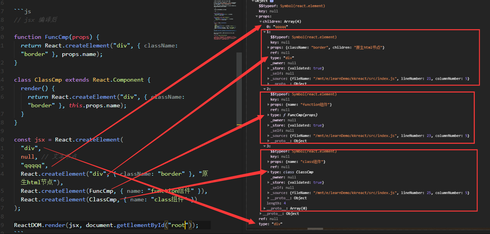

## 1. React 核心 API

### 1. [React 源码暴露出的 API](https://github.com/facebook/react/blob/master/packages/react/src/React.js)

```js
export {
  Children: {
    map,
    forEach,
    count,
    toArray,
    only,
  },
  createMutableSource,
  createRef,
  Component,
  PureComponent,
  createContext,
  forwardRef,
  lazy,
  memo,
  useCallback,
  useContext,
  useEffect,
  useImperativeHandle,
  useDebugValue,
  useLayoutEffect,
  useMemo,
  useMutableSource,
  useReducer,
  useRef,
  useState,
  REACT_FRAGMENT_TYPE as Fragment,
  REACT_PROFILER_TYPE as Profiler,
  REACT_STRICT_MODE_TYPE as StrictMode,
  REACT_DEBUG_TRACING_MODE_TYPE as unstable_DebugTracingMode,
  REACT_SUSPENSE_TYPE as Suspense,
  createElement,
  cloneElement,
  isValidElement,
  ReactVersion as version,
  ReactSharedInternals as __SECRET_INTERNALS_DO_NOT_USE_OR_YOU_WILL_BE_FIRED,
  // Deprecated behind disableCreateFactory
  createFactory,
  // Concurrent Mode
  useTransition,
  startTransition,
  useDeferredValue,
  REACT_SUSPENSE_LIST_TYPE as SuspenseList,
  REACT_LEGACY_HIDDEN_TYPE as unstable_LegacyHidden,
  // enableBlocksAPI
  block,
  // enableFundamentalAPI
  createFundamental as unstable_createFundamental,
  // enableScopeAPI
  REACT_SCOPE_TYPE as unstable_Scope,
  useOpaqueIdentifier as unstable_useOpaqueIdentifier,
};
```

#### Children

这个对象提供了一堆帮你处理 props.children 的方法，因为 children 是一个类似数组但是不是数组的数据结构，如果你要对其进行处理可以用 React.Children 外挂的方法。

#### React 核心

```js
const React = {
  createElement,
  Component,
};
```

### 2. react-dom

react-dom 主要是 render 逻辑

## 2. JSX 预编译

在编写 JSX 代码时，为何必须引用 React 呢？

这是因为 babel-loader 会预编译 JSX 为 React.createElement(...)，[在线尝试](https://zh-hans.reactjs.org/)，不引入 React 的话就无法使用 React.createElement 。

以下为 babel-loader 预编译示例，包含 function 组件、class 组件、文本节点、原生 html 节点：

```js
// jsx 编译前

function FuncCmp(props) {
  return <div className="border">{props.name}</div>;
}

class ClassCmp extends React.Component {
  render() {
    return <div className="border">{this.props.name}</div>;
  }
}

const jsx = (
  <div>
    {/* 1. 文本节点 */}
    qqqqq
    {/* 2. 原生html节点 */}
    <div className="border">原生html节点</div>
    {/* 3. function组件 */}
    <FuncCmp name="function组件" />
    {/* 4. class 组件 */}
    <ClassCmp name="class组件" />
  </div>
);

ReactDOM.render(jsx, document.getElementById("root"));
```

实际上，上下这两种写法是等价的。

```js
// jsx 编译后

function FuncCmp(props) {
  return React.createElement("div", { className: "border" }, props.name);
}

class ClassCmp extends React.Component {
  render() {
    return React.createElement("div", { className: "border" }, this.props.name);
  }
}

const jsx = React.createElement(
  "div",
  null, // 文本节点
  "qqqqq",
  React.createElement("div", { className: "border" }, "原生html节点"),
  React.createElement(FuncCmp, { name: "function组件" }),
  React.createElement(ClassCmp, { name: "class组件" })
);

ReactDOM.render(jsx, document.getElementById("root"));
```

React 把真实的 DOM 树转换成 Javascript 对象树，也就是 Virtual Dom



_注意，babel 在编译时会判断 JSX 中组件的首字母，当首字母为小写时，其被认定为原生 DOM 标签，createElement 的第一个变量被编译为字符串；当首字母为大写时，其被认定为自定义组件，createElement 的第一个变量被编译为对象_

虚拟 Dom 中有以下几个参数：

- `$$typeof`
  `$$typeof: REACT_ELEMENT_TYPE`，REACT_ELEMENT_TYPE 的值是一个 Symbol 类型，独一无二的值，React 渲染时会把没有\$\$typeof 标识，以及规则校验不通过的组件过滤掉，能够防止 XSS 攻击。

- key  循环中用到的 key 值

- props  所有的属性，比如 id, className, style, children 等(注意：这里 react 将 children 放到了 props 下)

- ref DOM 的引用

- type 元素类型，比如 div, function 组件, class 组件

- _owner 记录创建此元素的组件

## 3. React.createElement 原理与实现

```js
/**
 * createElement 记录dom节点的所有信息
 * @param {*} type dom节点标签名称
 * @param {Object} props 所有属性
 * @param {Array} childrens 子节点
 * @returns Object
 */
function createElement(type, props, ...childrens) {
  let vtype, ref, key;

  if (typeof type === "string") {
    vtype = 1; // 原生标签
  }
  if (typeof type === "function") {
    vtype = type.isReactComponent ? 2 : 3; // 原生标签
  }
  if('ref' in props){
    ref = props['ref'];
    props['ref'] = undefined;
  }
  if('key' in props){
    key = props['key'];
    props['key'] = undefined;
  }
  return {
    vtype, // 1-原生标签， 2-class组件，3-function组件
    type,
    ref,
    key,
    props: { ...props, children: childrens.length <=1 : childrens[0] || ''  : childrens},
  };
}
```

## 4. render 原理与实现
