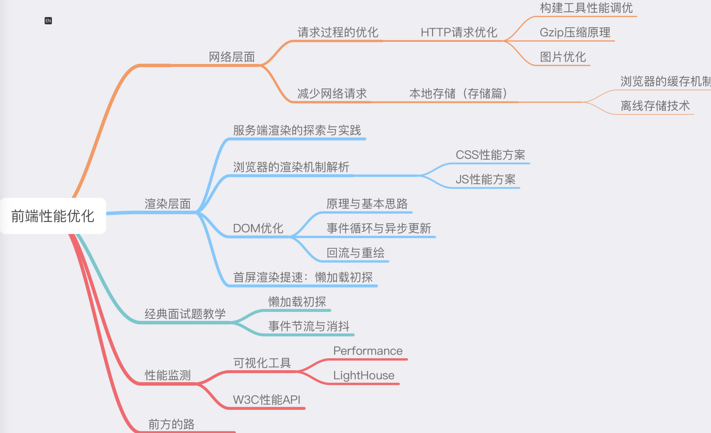

## 1. 一个面试题：从输⼊ url 到显示⻚⾯，到底发⽣了什么？

1. 用户输入网址

2. DNS 解析：把 url 解析成 IP

- 操作系统会先检查自己本地的 hosts 文件是否有这个网址映射关系，如果有，就先调用这个 IP 地址映射，完成域名解析
- 如果 hosts 里没有这个域名的映射，则查找本地 DNS 解析器缓存，是否有这个网址映射关系，如果有，直接返回，完成域名解析
- 如果 hosts 与本地 DNS 解析器缓存都没有相应的网址映射关系，首先会找 TCP/IP 参数中设置的首选 DNS 服务器，在此我们叫它本地 DNS 服务器，此服务器收到查询时，如果要查询的域名，包含在本地配置区域资源中，则返回解析结果给客户机，完成域名解析，此解析具有权威性。
- 如果本地 DNS 服务器本地区域文件与缓存解析都失效，则根据本地 DNS 服务器的设置，采用递归或者迭代查询，直至解析完成。

3. 和 IP 地址建立 TCP 连接，发送 HTTP 请求

- 客户端和服务器通过三次握手建立了 TCP 连接
- 建立 TCP 连接后发起 http 请求

4. 服务器响应请求，返回结果
5. 浏览器读取到首页的 HTML 源码后，它会解析 HTML，显示页面
6. 根据 HTML 里面的各种链接，再发送 HTTP 请求给服务器，拿到相应的图片、视频、Flash、JavaScript 脚本、CSS 等各种资源，最终显示出一个完整的页面

所谓性能优化，就是上面的步骤加⼀一起，时间尽可能的短，所以基本也有两大方向

1. 少加载文件
2. 少执行代码

性能优化体系


## 2. 雅虎军规

[参考文章](https://juejin.im/post/6844903657318645767#heading-2)

### 一、页面内容

#### 1. 减少 HTTP 请求

1. 合并 JS/CSS 文件。服务器端（CDN）自动合并，基于 Node.js 的文件合并工具，通过把所有脚本放在一个文件中的方式来减少请求数。
2. 使用 CSS Sprite 将背景图片合并成一个文件，通过 background-image 和 background-position 控制显示
3. 行内图片（Base64 编码）。使用 Data URI scheme 将图片嵌入 HTML 或者 CSS 中。例如：``(Data URL 形式的图片不会被浏览器缓存，这意味着每次访问页面时都被下载一次。)

#### 2. 减少 DNS 查询

用户输入 URL 以后，浏览器首先要查询域名（hostname）对应服务器的 IP 地址，一般需要耗费 20-120 毫秒时间。DNS 查询完成之前，浏览器无法从服务器下载任何数据。减少不同的主机名可减少 DNS 查找

#### 3. 避免重定向

HTTP 重定向通过 301/302 状态码实现。下面是一个有 301 状态码的 HTTP 头

```
 HTTP/1.1 301 Moved Permanently
 Location: http://example.com/newuri
 Content-Type: text/html
```

客户端收到服务器的重定向响应后，会根据响应头中 Location 的地址再次发送请求。重定向会影响用户体验，尤其是多次重定向时，用户在一段时间内看不到任何内容，只看到浏览器进度条一直在刷新。

#### 4. 缓存 Ajax 请求

有尚未过期的 Expires 或者 Cache-Control HTTP 头，那么之前的资源就可以从缓存中读出。必须通知浏览器，应该继续使用之前缓存的资源响应，还是去请求一个新的。可以通过给资源的 Ajax URL 里添加一个表明用户资源最后修改时间的时间戳来实现。如果资源从上一次下载之后再没有被修改过，时间戳不变，资源就将从浏览器缓存中直接读出，从而避免一次额外的 HTTP 往返消耗。

#### 5. 延迟加载

页面初始加载时哪些内容是绝对必需的？不在答案之列的资源都可以延迟加载。比如：

- 非首屏使用的数据、样式、脚本、图片等；
- 用户交互时才会显示的内容。

#### 6. 预加载

预先加载利用浏览器空闲时间请求将来要使用的资源，以便用户访问下一页面时更快地响应。

#### 7. 减少 DOM 元素数量

浏览器控制台中输入以下代码可以计算出页面中有多少 DOM 元素：

`document.getElementsByTagName('*').length;`

- 能通过伪元素实现的功能，就没必要添加额外元素，如清除浮动。
- 是否还在使用表格布局？
- 塞进去更多的<div>仅为了处理布局问题？也许有更好、更语义化的标记。

#### 8. 划分内容到不同域名

浏览器一般会限制每个域的并行线程（一般为 6 个，甚至更少），使用不同的域名可以最大化下载线程，但注意保持在 2-4 个域名内，以避免 DNS 查询损耗。
例如，动态内容放在 csspod.com 上，静态资源放在 static.csspod.com 上。这样还可以禁用静态资源域下的 Cookie，减少数据传输。

#### 9. 尽量减少 iframe

用 iframe 可以把一个 HTML 文档插入到父文档里，重要的是明白 iframe 是如何工作的并高效地使用它。

<iframe>的优点：

- 引入缓慢的第三方内容，比如标志和广告
- 安全沙箱
- 并行下载脚本

<iframe>的缺点：

- 代价高昂，即使是空白的 iframe
- 阻塞页面加载
  Iframe 完全加载以后，父页面才会触发 load 事件。 Safari、Chrome 中通过 JavaScript 动态设置 iframe src 可以避免这个问题。
- 非语义

#### 10. 避免 404 错误

HTTP 请求代价高昂，完全没有必要用一个 HTTP 请求去获取一个无用的响应（比如 404 Not Found），只会拖慢用户体验而没有任何好处。

### 二、CSS

#### 1. 把样式表放在<head>中

把样式表放在<head>中可以让页面渐进渲染，尽早呈现视觉反馈，给用户加载速度很快的感觉

#### 2. 不要使用 CSS 表达式

CSS 表达式可以在 CSS 里执行 JavaScript，仅 IE5-IE7 支持

#### 3. 使用<link>替代@import

在 IE 中用@import 与在底部用<link>效果一样，所以最好不要用它。

### 三、JavaScript

#### 1. 把脚本放在页面底部

脚本会阻塞并行下载，HTTP/1.1 官方文档建议浏览器每个主机名下并行下载的组件数不要超过两个，如果图片来自多个主机名，并行下载的数量就可以超过两个。如果脚本正在下载，浏览器就不开始任何其它下载任务，即使是在不同主机名下的。

#### 2. 使用外部 JavaScript 和 CSS

外部 JavaScript 和 CSS 文件可以被浏览器缓存，在不同页面间重用，也能降低页面大小。

当然，实际中也需要考虑代码的重用程度。如果仅仅是某个页面使用到的代码，可以考虑内嵌在页面中，减少 HTTP 请求数。另外，可以在首页加载完成以后，预先加载子页面的资源。

#### 3. 压缩 JavaScript 和 CSS

压缩代码可以移除非功能性的字符（注释、空格、空行等），减少文件大小，提高载入速度。

#### 4. 移除重复脚本

重复的脚本不仅产生不必要的 HTTP 请求，而且重复解析执行浪费时间和计算资源。

#### 5. 减少 DOM 操作

JavaScript 操作 DOM 很慢，尤其是 DOM 节点很多时。

### 四、图片

#### 1. 优化图片

尝试把 GIF 格式转换成 PNG 格式，看看是否节省空间。在所有的 PNG 图片上运行 pngcrush（或者其它 PNG 优化工具）。https://tinypng.com/ 运行 jpegtran 或其它工具压缩 jpeg。

#### 2. 优化 CSS Sprite

- 水平排列 Sprite 中的图片，垂直排列会增加图片大小；
- Spirite 中把颜色较近的组合在一起可以降低颜色数，理想状况是低于 256 色以适用 PNG8 格式；
- 不要在 Spirite 的图像中间留有较大空隙。减少空隙虽然不太影响文件大小，但可以降低用户代理把图片解压为像素图的内存消耗，对移动设备更友好。

#### 3. 不要在 HTML 中缩放图片

不要使用的 width、height 缩放图片，如果用到小图片，就使用相应大小的图片。如果需要 ``，那么图片本身（mycat.jpg）应该是 100x100px 的，而不是去缩小 500x500px 的图片。

#### 4. 使用体积小、可缓存的 favicon.ico

Favicon.ico 一般存放在网站根目录下，无论是否在页面中设置，浏览器都会尝试请求这个文件。所以确保这个图标：

- 存在（避免 404）；
- 尽量小，最好小于 1K；
- 设置较长的过期时间。

### 五、服务器

#### 1. 使用 CDN

用户与服务器的物理距离对响应时间也有影响。把内容部署在多个地理位置分散的服务器上能让用户更快地载入页面。
网站 80-90%响应时间消耗在资源下载上，减少资源下载时间是性能优化的黄金法则。相比分布式架构的复杂和巨大投入，静态内容分发网络（CDN）可以以较低的投入，获得加载速度有效提升。

内容分发网络（CDN）是一组分散在不同地理位置的 web 服务器，用来给用户更高效地发送内容。典型地，选择用来发送内容的服务器是基于网络距离的衡量标准的。例如：选跳数（hop）最少的或者响应时间最快的服务器。

#### 2. 添加 Expires 或 Cache-Control 响应头

- 静态内容：将 Expires 响应头设置为将来很远的时间，实现「永不过期」策略；
- 动态内容：设置合适的 Cache-Control 响应头，让浏览器有条件地发起请求。

#### 3. 启用 Gzip

Gzip 压缩通常可以减少 70%的响应大小，对某些文件更可能高达 90%，比 Deflate 更高效。主流 Web 服务器都有相应模块，而且绝大多数浏览器支持 gzip 解码。所以，应该对 HTML、CSS、JS、XML、JSON 等文本类型的内容启用压缩。

从 HTTP/1.1 开始，web 客户端就有了支持压缩的 Accept-Encoding HTTP 请求头。

`Accept-Encoding: gzip, deflate`

如果 web 服务器看到这个请求头，它就会用客户端列出的一种方式来压缩响应。web 服务器通过 Content-Encoding 响应头来通知客户端。

`Content-Encoding: gzip`

#### 4. 配置 Etag

实体标签（ETags），是服务器和浏览器用来决定浏览器缓存中组件与源服务器中的组件是否匹配的一种机制（“实体”也就是组件：图片，脚本，样式表等等）。添加 ETags 可以提供一种实体验证机制，比最后修改日期更加灵活。一个 ETag 是一个字符串，作为一个组件某一具体版本的唯一标识符。

#### 5. 尽早输出（flush）缓冲

#### 6. Ajax 请求使用 GET 方法

浏览器执行 XMLHttpRequest POST 请求时分成两步，先发送 Http Header，再发送 data。而 GET 只使用一个 TCP 数据包（Http Header 与 data）发送数据，所以首选 GET 方法。

#### 7. 避免图片 src 为空

虽然 src 属性为空字符串，但浏览器仍然会向服务器发起一个 HTTP 请求

空的 href 属性也存在类似问题。用户点击空链接时，浏览器也会向服务器发送 HTTP 请求，可以通过 JavaScript 阻止空链接的默认的行为。

### 六. Cookie

#### 1. 减少 Cookie 大小

Cookie 被用于身份认证、个性化设置等诸多用途。Cookie 通过 HTTP 头在服务器和浏览器间来回传送，减少 Cookie 大小可以降低其对响应速度的影响。

#### 2. 静态资源使用无 Cookie 域名

静态资源一般无需使用 Cookie，可以把它们放在使用二级域名或者专门域名的无 Cookie 服务器上，降低 Cookie 传送的造成的流量浪费，提高响应速度。
