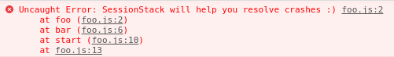
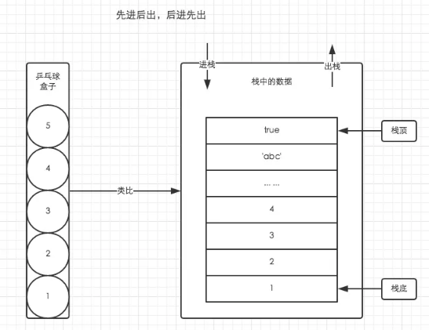
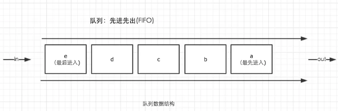
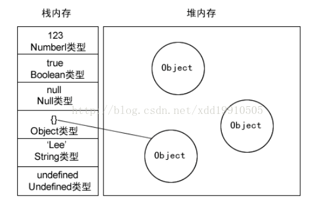

# JS相关


## 1.  [这一次，彻底弄懂 JavaScript 执行机制](https://juejin.im/post/59e85eebf265da430d571f89)

> javascript是一门单线程语言
>
> Event Loop是javascript的执行机制


**同步任务与异步任务**


**微任务与宏任务**

事件循环的顺序，决定js代码的执行顺序。进入整体代码(宏任务)后，开始第一次循环。接着执行所有的微任务。然后再次从宏任务开始，找到其中一个任务队列执行完毕，再执行所有的微任务。

- macro-task(宏任务)：包括整体代码script，setTimeout，setInterval
- micro-task(微任务)：Promise，process.nextTick


## 2. [理解JavaScript 中的执行上下文和执行栈](https://muyiy.cn/blog/1/1.1.html#执行上下文的类型)


#### 执行栈

执行栈，也叫调用栈，具有 LIFO（后进先出）结构，用于存储在代码执行期间创建的所有执行上下文。

首次运行JS代码时，会创建一个**全局**执行上下文并Push到当前的执行栈中。每当发生函数调用，引擎都会为该函数创建一个**新的函数**执行上下文并Push到当前执行栈的栈顶。

根据执行栈LIFO规则，当栈顶函数运行完成后，其对应的**函数**执行上下文将会从执行栈中Pop出，上下文控制权将移到当前执行栈的**下一个**执行上下文


#### **函数上下文**

调用函数时，会为其创建一个**Arguments对象**，并自动初始化局部变量arguments，指代该Arguments对象。所有作为参数传入的值都会成为Arguments对象的数组元素。


- 1、全局上下文的变量对象初始化是全局对象
- 2、函数上下文的变量对象初始化只包括 Arguments 对象
- 3、在进入执行上下文时会给变量对象**添加形参、函数声明、变量声明**等初始的属性值
- 4、在代码执行阶段，会再次修改变量对象的属性值


## 3. [内存空间](https://muyiy.cn/blog/1/1.3.html#栈数据结构)

**补充一个知识点**：某些情况下，调用堆栈中函数调用的数量超出了调用堆栈的实际大小，浏览器会抛出一个错误终止运行。

对于下面的递归就会无限制的执行下去，直到超出调用堆栈的实际大小，这个是浏览器定义的。

```js
function foo() {
    foo();
}
foo();
```



#### 

#### 栈数据结构

> 栈的结构就是后进先出**（LIFO）**




#### 堆数据结构

堆数据结构是一种树状结构。它的存取数据的方式与书架和书非常相似。我们只需要知道书的名字就可以直接取出书了，并不需要把上面的书取出来。JSON格式的数据中，我们存储的`key-value`可以是无序的，因为顺序的不同并不影响我们的使用，我们只需要关心书的名字


#### 队列

队列是一种先进先出（**FIFO**）的数据结构，这是事件循环（Event Loop）的基础结构




#### 变量的存放

首先我们应该知道内存中有栈和堆，那么变量应该存放在哪里呢，**堆**？**栈**？

- 1、基本类型 --> 保存在**栈**内存中，因为这些类型在内存中分别占有固定大小的空间，通过按值来访问。基本类型一共有6种：Undefined、Null、Boolean、Number 、String和Symbol
- 2、引用类型 --> 保存在**堆**内存中，因为这种值的大小不固定，因此不能把它们保存到栈内存中，但内存地址大小的固定的，因此保存在堆内存中，在栈内存中存放的只是该对象的访问地址。当查询引用类型的变量时， 先从**栈中读取内存地址**， 然后再通过地址**找到堆中的值**。对于这种，我们把它叫做按引用访问。



在计算机的数据结构中，栈比堆的运算速度快，Object是一个复杂的结构且可以扩展：数组可扩充，对象可添加属性，都可以增删改查。将他们放在堆中是为了不影响栈的效率。而是通过引用的方式查找到堆中的实际对象再进行操作。所以查找引用类型值的时候先去**栈**查找再去**堆**查找。