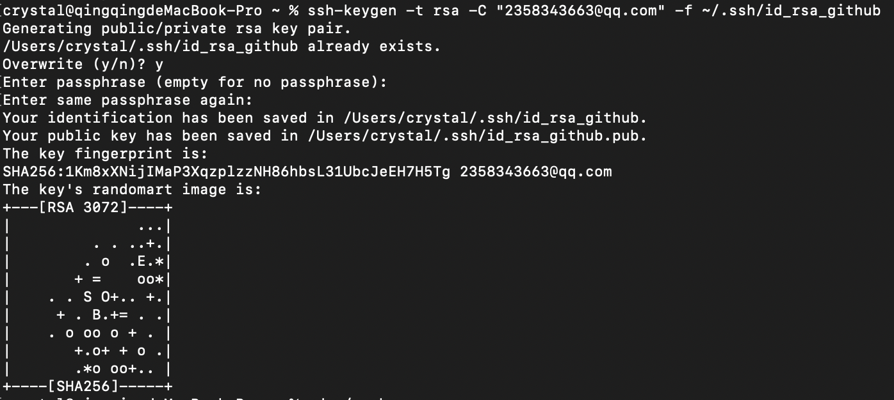

<!--
 * @Author: your name
 * @Date: 2021-03-10 18:08:23
 * @LastEditTime: 2021-04-14 17:59:59
 * @LastEditors: Please set LastEditors
 * @Description: In User Settings Edit
 * @FilePath: /crystal-github/Notes/summary/2021/问题总结.md
-->

1. GitHub 无法访问、443 Operation timed out 的解决办法

https://juejin.cn/post/6844904193170341896

2. ssh-keygen 命令


ssh-keygen 命令用于为 ssh 生成、管理和转换认证密钥，它支持 RSA 和 DSA 两种认证密钥。该命令的选项：

```
-b：指定密钥长度；
-e：读取openssh的私钥或者公钥文件；
-C：添加注释；
-f：指定用来保存密钥的文件名；
-i：读取未加密的ssh-v2兼容的私钥/公钥文件，然后在标准输出设备上显示openssh兼容的私钥/公钥；
-l：显示公钥文件的指纹数据；
-N：提供一个新密语；
-P：提供（旧）密语；
-q：静默模式；
-t：指定要创建的密钥类型。
```

生成密钥对时，有一个选项要求你设置密码（passphrase），该密码是用来保护你的私钥的密码。如果设置了则在使用私钥时会要求你输入这个密码；一般不设置，记不住【之后还可更改此密码，使用ssh-keygen -p】。

```bash
cd ~/.ssh    #进入文件
ssh-keygen -t rsa -C "email@xx.com"   #创建一个ssh的密钥
# ssh-keygen -t rsa -C "email@xx.com" -f ~/.ssh/id_rsa_github (别名)
# id_rsa 和 id_rsa.pub   pub文件放置的，就是我们的公开的ssh码
```



公钥是一串很长的字符；为了便于肉眼比对和识别，所以有了指纹这东西；指纹位数短，更便于识别且与公钥一一对应。

公钥加密指纹fingerprint有两种形式：

之前的十六进制形式：16:27:ac:a5:76:28:2d:36:63:1b:56:4d:eb:df:a6:48
现在使用sha256哈希值并且使用base64进行格式：SHA256:nThbg6kXUpJWGl7E1IGOCspRomTxdCARLviKw6E5SY8
指纹的用处之一是在使用SSH第一次连接到某主机时，会返回该主机使用的公钥的指纹让你识别。
